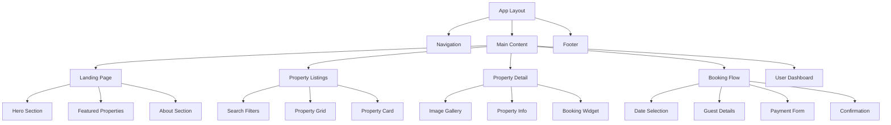
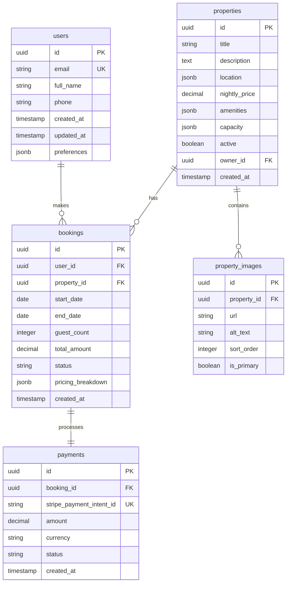

# We Call It Homes - Booking System Design Document

## 1. Overview

### Project Vision
"We Call It Homes" is a luxury property booking platform that combines the immersive design philosophy of Apple with the functional excellence of Airbnb. The platform enables users to discover and book premium properties for nightly stays through a cinematic, modern interface.

### Core Objectives
- **Immersion**: Deliver a cinematic, luxury hotel-inspired user experience
- **Functionality**: Provide seamless property search, booking, and payment processing
- **Performance**: Ensure fast loading, smooth animations, and optimal SEO
- **Responsiveness**: Deliver flawless experience across all devices

### Target Audience
- Premium travelers seeking luxury accommodations
- Users who value design and user experience
- Mobile-first users expecting smooth interactions

## 2. Technology Stack & Dependencies

### Frontend Architecture
```
Next.js 15 (App Router)
├── React 18+
├── TypeScript
├── Tailwind CSS
├── Framer Motion
├── Radix UI Components
├── React Hook Form
├── Zod (validation)
└── Next-themes
```

### Backend & Infrastructure
```
Supabase Platform
├── PostgreSQL Database
├── Authentication Service
├── Real-time subscriptions
├── Edge Functions
├── Storage for images
└── Row Level Security
```

### Payment & External Services
```
Integration Layer
├── Stripe Payment Processing
├── Stripe Webhooks
├── Email Service (Resend/SendGrid)
├── Image Optimization (Next.js)
└── Google Maps API
```

### Development & Deployment
```
Deployment Pipeline
├── Vercel (Frontend hosting)
├── Supabase (Backend services)
├── GitHub Actions (CI/CD)
└── Lighthouse CI (Performance)
```

## 3. Component Architecture

### Component Hierarchy



### Core Components Definition

#### Layout Components
| Component | Purpose | Props | State Management |
|-----------|---------|-------|------------------|
| `AppLayout` | Root layout wrapper | `children`, `showNav` | Theme, user session |
| `Navigation` | Header navigation | `transparent`, `fixed` | Auth state, cart |
| `Footer` | Site footer | `minimal` | None |
| `Sidebar` | Mobile navigation | `isOpen`, `onClose` | Local state |

#### Landing Page Components
| Component | Purpose | Props | Animations |
|-----------|---------|-------|------------|
| `HeroSection` | Cinematic hero area | `backgroundVideo`, `headline` | Parallax scroll, fade-in |
| `PropertyShowcase` | Featured properties | `properties[]` | Stagger animation |
| `StorySection` | Brand storytelling | `content`, `images[]` | Scroll-triggered reveals |
| `CTASection` | Call-to-action | `title`, `description` | Hover effects |

#### Property Components
| Component | Purpose | Props | Interactions |
|-----------|---------|-------|--------------|
| `PropertyCard` | Property preview | `property`, `variant` | Hover zoom, overlay |
| `PropertyGrid` | Properties listing | `properties[]`, `loading` | Infinite scroll |
| `SearchFilters` | Filter controls | `filters`, `onChange` | Real-time filtering |
| `PropertyGallery` | Image carousel | `images[]`, `autoplay` | Touch gestures, keyboard |

#### Booking Components
| Component | Purpose | Props | Validation |
|-----------|---------|-------|------------|
| `DatePicker` | Date selection | `startDate`, `endDate` | Availability check |
| `BookingWidget` | Pricing calculator | `property`, `dates` | Real-time pricing |
| `PaymentForm` | Stripe integration | `amount`, `onSuccess` | PCI compliance |
| `BookingConfirmation` | Success state | `booking` | Email trigger |

### Component State Management

#### Global State (Zustand)
```typescript
interface AppState {
  user: User | null
  bookingFlow: {
    property: Property | null
    dates: DateRange | null
    guests: number
    pricing: PricingBreakdown | null
  }
  ui: {
    theme: 'light' | 'dark'
    sidebarOpen: boolean
    loading: boolean
  }
}
```

#### Local Component State
- Form states managed by React Hook Form
- Animation states handled by Framer Motion
- UI interactions through useState/useReducer

### Props & Interface Definitions

#### Core Data Types
```typescript
interface Property {
  id: string
  title: string
  description: string
  location: Location
  images: ImageAsset[]
  amenities: Amenity[]
  pricing: {
    basePrice: number
    cleaningFee: number
    serviceFee: number
  }
  availability: DateRange[]
  capacity: {
    guests: number
    bedrooms: number
    bathrooms: number
  }
}

interface Booking {
  id: string
  userId: string
  propertyId: string
  dateRange: DateRange
  guestCount: number
  pricing: PricingBreakdown
  status: BookingStatus
  paymentId?: string
}
```

## 4. Routing & Navigation

### Route Structure

```mermaid
graph LR
    A[/] --> B[Landing Page]
    C[/properties] --> D[Property Listings]
    E[/properties/[id]] --> F[Property Detail]
    G[/book/[id]] --> H[Booking Flow]
    I[/dashboard] --> J[User Dashboard]
    K[/about] --> L[About Page]
    M[/auth] --> N[Auth Pages]
```

### Navigation Architecture

#### App Router Implementation
```
app/
├── layout.tsx                 # Root layout
├── page.tsx                  # Landing page
├── properties/
│   ├── page.tsx             # Property listings
│   └── [id]/
│       ├── page.tsx         # Property detail
│       └── book/
│           └── page.tsx     # Booking flow
├── dashboard/
│   ├── layout.tsx           # Dashboard layout
│   ├── page.tsx            # Dashboard home
│   ├── bookings/
│   │   └── page.tsx        # Booking management
│   └── profile/
│       └── page.tsx        # Profile settings
└── auth/
    ├── login/
    │   └── page.tsx        # Login page
    └── register/
        └── page.tsx        # Registration
```

#### Route Protection
- Public routes: `/`, `/properties`, `/properties/[id]`, `/about`
- Protected routes: `/dashboard/*`, `/book/*`
- Auth routes: `/auth/*` (redirect if authenticated)

#### Navigation Components
```typescript
// Navigation state management
interface NavigationState {
  currentPath: string
  previousPath: string
  breadcrumbs: Breadcrumb[]
  transition: 'slide' | 'fade' | 'none'
}

// Route transitions
const pageTransitions = {
  initial: { opacity: 0, y: 20 },
  animate: { opacity: 1, y: 0 },
  exit: { opacity: 0, y: -20 }
}
```

## 5. Styling Strategy

### Design System Foundation

#### Color Palette
```scss
:root {
  /* Primary Colors */
  --color-navy: #1a237e;
  --color-gold: #ffd700;
  --color-emerald: #00695c;
  
  /* Neutral Colors */
  --color-white: #ffffff;
  --color-black: #000000;
  --color-gray-50: #fafafa;
  --color-gray-900: #0f172a;
  
  /* Semantic Colors */
  --color-success: #10b981;
  --color-error: #ef4444;
  --color-warning: #f59e0b;
}
```

#### Typography Scale
```scss
/* Font Families */
--font-serif: "Playfair Display", Georgia, serif;
--font-sans: "Inter", -apple-system, sans-serif;

/* Type Scale */
--text-xs: 0.75rem;    /* 12px */
--text-sm: 0.875rem;   /* 14px */
--text-base: 1rem;     /* 16px */
--text-lg: 1.125rem;   /* 18px */
--text-xl: 1.25rem;    /* 20px */
--text-2xl: 1.5rem;    /* 24px */
--text-3xl: 1.875rem;  /* 30px */
--text-4xl: 2.25rem;   /* 36px */
--text-5xl: 3rem;      /* 48px */
```

### Tailwind Configuration

#### Custom Theme Extensions
```javascript
// tailwind.config.js
module.exports = {
  theme: {
    extend: {
      fontFamily: {
        serif: ['Playfair Display', 'Georgia', 'serif'],
        sans: ['Inter', 'system-ui', 'sans-serif'],
      },
      colors: {
        navy: {
          50: '#e8eaf6',
          500: '#3f51b5',
          900: '#1a237e',
        },
        gold: {
          50: '#fffbeb',
          500: '#fbbf24',
          900: '#92400e',
        }
      },
      animation: {
        'fade-in': 'fadeIn 0.6s ease-out',
        'slide-up': 'slideUp 0.8s ease-out',
        'parallax': 'parallax 1s ease-out',
      },
      backgroundImage: {
        'gradient-radial': 'radial-gradient(var(--tw-gradient-stops))',
        'glass': 'linear-gradient(135deg, rgba(255,255,255,0.1), rgba(255,255,255,0.05))',
      }
    }
  }
}
```

#### Component Styling Patterns
```typescript
// Glassmorphism utility classes
const glassClasses = [
  'bg-white/10',
  'backdrop-blur-md',
  'border',
  'border-white/20',
  'shadow-lg'
].join(' ')

// Luxury button variants
const buttonVariants = {
  primary: 'bg-navy-900 text-white hover:bg-navy-700 transition-all duration-300',
  secondary: 'bg-white/20 backdrop-blur-md border border-white/30 hover:bg-white/30',
  gold: 'bg-gradient-to-r from-gold-500 to-gold-600 text-black hover:from-gold-600 hover:to-gold-700'
}
```

### Responsive Design Strategy

#### Breakpoint System
```scss
/* Mobile First Approach */
@media (min-width: 640px)  { /* sm */ }
@media (min-width: 768px)  { /* md */ }
@media (min-width: 1024px) { /* lg */ }
@media (min-width: 1280px) { /* xl */ }
@media (min-width: 1536px) { /* 2xl */ }
```

#### Component Responsiveness
- Grid layouts: `grid-cols-1 md:grid-cols-2 xl:grid-cols-3`
- Text sizing: `text-2xl md:text-4xl xl:text-5xl`
- Spacing: `p-4 md:p-8 xl:p-12`
- Images: `aspect-square md:aspect-video`

## 6. State Management

### Zustand Store Architecture

#### Main Store Structure
```typescript
interface BookingSystemState {
  // User Management
  user: UserState
  setUser: (user: User | null) => void
  
  // Booking Flow
  booking: BookingFlowState
  updateBookingStep: (step: BookingStep) => void
  resetBooking: () => void
  
  // Property Management
  properties: PropertyState
  setProperties: (properties: Property[]) => void
  addProperty: (property: Property) => void
  
  // UI State
  ui: UIState
  toggleSidebar: () => void
  setLoading: (loading: boolean) => void
  setTheme: (theme: Theme) => void
}
```

#### Booking Flow State
```typescript
interface BookingFlowState {
  currentStep: 'dates' | 'guests' | 'payment' | 'confirmation'
  property: Property | null
  dateRange: {
    startDate: Date | null
    endDate: Date | null
  }
  guestCount: number
  pricing: {
    basePrice: number
    nights: number
    subtotal: number
    cleaningFee: number
    serviceFee: number
    taxes: number
    total: number
  } | null
  paymentIntent: string | null
}
```

### React Query Integration

#### Query Configuration
```typescript
// Query client setup
const queryClient = new QueryClient({
  defaultOptions: {
    queries: {
      staleTime: 5 * 60 * 1000, // 5 minutes
      cacheTime: 10 * 60 * 1000, // 10 minutes
      retry: 3,
      refetchOnWindowFocus: false,
    },
  },
})

// Custom hooks for data fetching
export const useProperties = (filters?: PropertyFilters) =>
  useQuery(['properties', filters], () => fetchProperties(filters))

export const useProperty = (id: string) =>
  useQuery(['property', id], () => fetchProperty(id))

export const useBookings = (userId: string) =>
  useQuery(['bookings', userId], () => fetchUserBookings(userId))
```

#### Mutation Patterns
```typescript
// Booking creation mutation
export const useCreateBooking = () =>
  useMutation({
    mutationFn: createBooking,
    onSuccess: (booking) => {
      queryClient.invalidateQueries(['bookings'])
      // Redirect to confirmation
    },
    onError: (error) => {
      // Show error notification
    }
  })
```

### Form State Management

#### React Hook Form Integration
```typescript
interface BookingFormData {
  property: string
  dateRange: DateRange
  guests: number
  userDetails: UserDetails
  paymentMethod: PaymentMethod
}

const useBookingForm = () => {
  const form = useForm<BookingFormData>({
    resolver: zodResolver(bookingSchema),
    mode: 'onChange',
  })
  
  const watchedValues = useWatch({ control: form.control })
  
  // Real-time pricing calculation
  const pricing = useMemo(() => 
    calculatePricing(watchedValues), [watchedValues])
  
  return { form, pricing, watchedValues }
}
```

## 7. API Integration Layer

### Supabase Client Configuration

#### Authentication Setup
```typescript
const supabase = createClient(
  process.env.NEXT_PUBLIC_SUPABASE_URL!,
  process.env.NEXT_PUBLIC_SUPABASE_ANON_KEY!,
  {
    auth: {
      autoRefreshToken: true,
      persistSession: true,
      detectSessionInUrl: true
    }
  }
)
```

#### API Service Layer
```typescript
class PropertyService {
  async getProperties(filters: PropertyFilters): Promise<Property[]> {
    let query = supabase
      .from('properties')
      .select('*, images(*), amenities(*)')
    
    if (filters.location) {
      query = query.ilike('location', `%${filters.location}%`)
    }
    
    if (filters.priceRange) {
      query = query
        .gte('nightly_price', filters.priceRange.min)
        .lte('nightly_price', filters.priceRange.max)
    }
    
    const { data, error } = await query
    if (error) throw new Error(error.message)
    return data
  }
  
  async checkAvailability(
    propertyId: string, 
    dateRange: DateRange
  ): Promise<boolean> {
    const { data } = await supabase
      .from('bookings')
      .select('id')
      .eq('property_id', propertyId)
      .overlaps('date_range', `[${dateRange.start},${dateRange.end}]`)
    
    return data?.length === 0
  }
}
```

### Stripe Integration

#### Payment Processing Flow
```typescript
class PaymentService {
  async createPaymentIntent(
    amount: number,
    bookingData: BookingData
  ): Promise<PaymentIntent> {
    const response = await fetch('/api/payments/create-intent', {
      method: 'POST',
      headers: { 'Content-Type': 'application/json' },
      body: JSON.stringify({ amount, bookingData })
    })
    
    return response.json()
  }
  
  async confirmPayment(
    paymentIntentId: string,
    paymentMethodId: string
  ): Promise<PaymentResult> {
    const stripe = await getStripe()
    
    return stripe.confirmCardPayment(paymentIntentId, {
      payment_method: paymentMethodId
    })
  }
}
```

#### Webhook Handling
```typescript
// /api/webhooks/stripe
export async function POST(request: Request) {
  const sig = request.headers.get('stripe-signature')!
  let event: Stripe.Event
  
  try {
    event = stripe.webhooks.constructEvent(
      await request.text(),
      sig,
      process.env.STRIPE_WEBHOOK_SECRET!
    )
  } catch (err) {
    return new Response(`Webhook signature verification failed`, {
      status: 400
    })
  }
  
  switch (event.type) {
    case 'payment_intent.succeeded':
      await handlePaymentSuccess(event.data.object)
      break
    case 'payment_intent.payment_failed':
      await handlePaymentFailure(event.data.object)
      break
  }
  
  return new Response('Success', { status: 200 })
}
```

### Real-time Features

#### Live Availability Updates
```typescript
const usePropertyAvailability = (propertyId: string) => {
  const [availability, setAvailability] = useState<DateRange[]>([])
  
  useEffect(() => {
    const channel = supabase
      .channel('property-bookings')
      .on('postgres_changes', {
        event: '*',
        schema: 'public',
        table: 'bookings',
        filter: `property_id=eq.${propertyId}`
      }, (payload) => {
        // Update availability in real-time
        updateAvailability(payload)
      })
      .subscribe()
    
    return () => supabase.removeChannel(channel)
  }, [propertyId])
  
  return availability
}
```

## 8. Testing Strategy

### Unit Testing Framework

#### Component Testing with React Testing Library
```typescript
// PropertyCard component test
describe('PropertyCard', () => {
  const mockProperty = {
    id: '1',
    title: 'Luxury Villa',
    location: 'Malibu, CA',
    price: 500,
    images: ['image1.jpg']
  }
  
  it('renders property information correctly', () => {
    render(<PropertyCard property={mockProperty} />)
    
    expect(screen.getByText('Luxury Villa')).toBeInTheDocument()
    expect(screen.getByText('Malibu, CA')).toBeInTheDocument()
    expect(screen.getByText('$500')).toBeInTheDocument()
  })
  
  it('handles hover interactions', async () => {
    render(<PropertyCard property={mockProperty} />)
    
    const card = screen.getByTestId('property-card')
    await userEvent.hover(card)
    
    expect(card).toHaveClass('scale-105')
  })
})
```

#### API Service Testing
```typescript
// Mock Supabase client
jest.mock('@supabase/supabase-js', () => ({
  createClient: jest.fn(() => ({
    from: jest.fn(() => ({
      select: jest.fn(() => ({
        eq: jest.fn(() => Promise.resolve({ data: mockData, error: null }))
      }))
    }))
  }))
}))

describe('PropertyService', () => {
  it('fetches properties with filters', async () => {
    const service = new PropertyService()
    const filters = { location: 'Malibu', maxPrice: 1000 }
    
    const properties = await service.getProperties(filters)
    
    expect(properties).toHaveLength(3)
    expect(properties[0]).toHaveProperty('title')
  })
})
```

### Integration Testing

#### Booking Flow End-to-End Test
```typescript
describe('Booking Flow Integration', () => {
  it('completes full booking process', async () => {
    // Mock Stripe
    const mockStripe = {
      confirmCardPayment: jest.fn(() => 
        Promise.resolve({ paymentIntent: { status: 'succeeded' } })
      )
    }
    
    // Render booking flow
    render(<BookingFlow propertyId="1" />)
    
    // Select dates
    const startDate = screen.getByLabelText('Check-in')
    await userEvent.type(startDate, '2024-06-01')
    
    // Enter payment details
    const cardInput = screen.getByLabelText('Card number')
    await userEvent.type(cardInput, '4242424242424242')
    
    // Submit booking
    const submitButton = screen.getByText('Complete Booking')
    await userEvent.click(submitButton)
    
    // Verify success
    await waitFor(() => {
      expect(screen.getByText('Booking Confirmed')).toBeInTheDocument()
    })
  })
})
```

### Performance Testing

#### Lighthouse CI Configuration
```yaml
# .github/workflows/lighthouse.yml
name: Lighthouse CI
on:
  pull_request:
    branches: [main]

jobs:
  lighthouse:
    runs-on: ubuntu-latest
    steps:
      - uses: actions/checkout@v3
      - name: Run Lighthouse CI
        uses: treosh/lighthouse-ci-action@v9
        with:
          configPath: './lighthouserc.json'
          uploadArtifacts: true
```

#### Performance Benchmarks
```json
{
  "ci": {
    "assert": {
      "assertions": {
        "categories:performance": ["error", {"minScore": 0.9}],
        "categories:accessibility": ["error", {"minScore": 0.9}],
        "categories:best-practices": ["error", {"minScore": 0.9}],
        "categories:seo": ["error", {"minScore": 0.9}]
      }
    }
  }
}
```

### Visual Regression Testing

#### Storybook Integration
```typescript
// .storybook/main.ts
export default {
  stories: ['../src/**/*.stories.@(js|jsx|ts|tsx)'],
  addons: [
    '@storybook/addon-essentials',
    '@storybook/addon-a11y',
    'chromatic/isChromatic'
  ],
  features: {
    buildStoriesJson: true
  }
}
```

#### Component Stories
```typescript
// PropertyCard.stories.tsx
export default {
  title: 'Components/PropertyCard',
  component: PropertyCard,
  parameters: {
    layout: 'padded',
    backgrounds: {
      default: 'light'
    }
  }
}

export const Default: Story = {
  args: {
    property: {
      title: 'Luxury Villa',
      location: 'Malibu, CA',
      price: 500,
      rating: 4.8,
      images: ['/property-1.jpg']
    }
  }
}

export const Hover: Story = {
  args: Default.args,
  parameters: {
    pseudo: { hover: true }
  }
}
```

### Test Coverage Requirements
- Unit tests: 80% coverage minimum
- Integration tests: Critical user flows
- E2E tests: Complete booking journey
- Visual regression: All UI components
- Performance: Core Web Vitals compliance

## 9. Database Schema & Models

### Supabase Database Design

#### Core Tables Structure



#### Table Definitions

##### Users Table
```sql
CREATE TABLE users (
  id UUID PRIMARY KEY DEFAULT gen_random_uuid(),
  email VARCHAR(255) UNIQUE NOT NULL,
  full_name VARCHAR(255) NOT NULL,
  phone VARCHAR(20),
  avatar_url TEXT,
  preferences JSONB DEFAULT '{}',
  created_at TIMESTAMP WITH TIME ZONE DEFAULT NOW(),
  updated_at TIMESTAMP WITH TIME ZONE DEFAULT NOW()
);

-- Enable RLS
ALTER TABLE users ENABLE ROW LEVEL SECURITY;

-- Users can only see their own data
CREATE POLICY "Users can view own profile" ON users
  FOR SELECT USING (auth.uid() = id);

CREATE POLICY "Users can update own profile" ON users
  FOR UPDATE USING (auth.uid() = id);
```

##### Properties Table
```sql
CREATE TABLE properties (
  id UUID PRIMARY KEY DEFAULT gen_random_uuid(),
  title VARCHAR(255) NOT NULL,
  description TEXT,
  location JSONB NOT NULL, -- {address, city, state, country, coordinates}
  nightly_price DECIMAL(10,2) NOT NULL,
  cleaning_fee DECIMAL(10,2) DEFAULT 0,
  service_fee DECIMAL(10,2) DEFAULT 0,
  amenities JSONB DEFAULT '[]', -- Array of amenity objects
  capacity JSONB NOT NULL, -- {guests, bedrooms, bathrooms, beds}
  house_rules TEXT[],
  cancellation_policy VARCHAR(50) DEFAULT 'moderate',
  active BOOLEAN DEFAULT true,
  owner_id UUID REFERENCES users(id),
  created_at TIMESTAMP WITH TIME ZONE DEFAULT NOW(),
  updated_at TIMESTAMP WITH TIME ZONE DEFAULT NOW()
);

-- Indexes for performance
CREATE INDEX idx_properties_location_gin ON properties USING GIN (location);
CREATE INDEX idx_properties_price ON properties (nightly_price);
CREATE INDEX idx_properties_active ON properties (active) WHERE active = true;

-- Enable RLS
ALTER TABLE properties ENABLE ROW LEVEL SECURITY;

-- Anyone can view active properties
CREATE POLICY "Anyone can view active properties" ON properties
  FOR SELECT USING (active = true);
```

##### Property Images Table
```sql
CREATE TABLE property_images (
  id UUID PRIMARY KEY DEFAULT gen_random_uuid(),
  property_id UUID REFERENCES properties(id) ON DELETE CASCADE,
  url TEXT NOT NULL,
  alt_text VARCHAR(255),
  sort_order INTEGER DEFAULT 0,
  is_primary BOOLEAN DEFAULT false,
  created_at TIMESTAMP WITH TIME ZONE DEFAULT NOW()
);

-- Ensure only one primary image per property
CREATE UNIQUE INDEX idx_property_primary_image 
  ON property_images (property_id) 
  WHERE is_primary = true;

CREATE INDEX idx_property_images_sort ON property_images (property_id, sort_order);
```

##### Bookings Table
```sql
CREATE TABLE bookings (
  id UUID PRIMARY KEY DEFAULT gen_random_uuid(),
  user_id UUID REFERENCES users(id) NOT NULL,
  property_id UUID REFERENCES properties(id) NOT NULL,
  start_date DATE NOT NULL,
  end_date DATE NOT NULL,
  guest_count INTEGER NOT NULL CHECK (guest_count > 0),
  total_amount DECIMAL(10,2) NOT NULL,
  status VARCHAR(50) DEFAULT 'pending' CHECK (
    status IN ('pending', 'confirmed', 'cancelled', 'completed')
  ),
  pricing_breakdown JSONB NOT NULL,
  special_requests TEXT,
  created_at TIMESTAMP WITH TIME ZONE DEFAULT NOW(),
  updated_at TIMESTAMP WITH TIME ZONE DEFAULT NOW(),
  
  -- Ensure end date is after start date
  CONSTRAINT valid_date_range CHECK (end_date > start_date),
  
  -- Prevent overlapping bookings for same property
  EXCLUDE USING gist (
    property_id WITH =,
    daterange(start_date, end_date, '[]') WITH &&
  ) WHERE (status IN ('confirmed', 'pending'))
);

-- Indexes
CREATE INDEX idx_bookings_user ON bookings (user_id);
CREATE INDEX idx_bookings_property ON bookings (property_id);
CREATE INDEX idx_bookings_dates ON bookings (start_date, end_date);
CREATE INDEX idx_bookings_status ON bookings (status);

-- Enable RLS
ALTER TABLE bookings ENABLE ROW LEVEL SECURITY;

-- Users can only see their own bookings
CREATE POLICY "Users can view own bookings" ON bookings
  FOR SELECT USING (auth.uid() = user_id);

CREATE POLICY "Users can create own bookings" ON bookings
  FOR INSERT WITH CHECK (auth.uid() = user_id);
```

##### Payments Table
```sql
CREATE TABLE payments (
  id UUID PRIMARY KEY DEFAULT gen_random_uuid(),
  booking_id UUID REFERENCES bookings(id) NOT NULL,
  stripe_payment_intent_id VARCHAR(255) UNIQUE NOT NULL,
  amount DECIMAL(10,2) NOT NULL,
  currency VARCHAR(3) DEFAULT 'USD',
  status VARCHAR(50) NOT NULL CHECK (
    status IN ('pending', 'processing', 'succeeded', 'failed', 'cancelled')
  ),
  payment_method_id VARCHAR(255),
  failure_reason TEXT,
  metadata JSONB DEFAULT '{}',
  created_at TIMESTAMP WITH TIME ZONE DEFAULT NOW(),
  updated_at TIMESTAMP WITH TIME ZONE DEFAULT NOW()
);

-- Indexes
CREATE INDEX idx_payments_booking ON payments (booking_id);
CREATE INDEX idx_payments_stripe_pi ON payments (stripe_payment_intent_id);
CREATE INDEX idx_payments_status ON payments (status);
```

### Database Functions & Triggers

#### Availability Check Function
```sql
CREATE OR REPLACE FUNCTION check_property_availability(
  p_property_id UUID,
  p_start_date DATE,
  p_end_date DATE
) RETURNS BOOLEAN AS $$
DECLARE
  conflict_count INTEGER;
BEGIN
  SELECT COUNT(*)
  INTO conflict_count
  FROM bookings
  WHERE property_id = p_property_id
    AND status IN ('confirmed', 'pending')
    AND daterange(start_date, end_date, '[]') && 
        daterange(p_start_date, p_end_date, '[]');
  
  RETURN conflict_count = 0;
END;
$$ LANGUAGE plpgsql;
```

#### Price Calculation Function
```sql
CREATE OR REPLACE FUNCTION calculate_booking_price(
  p_property_id UUID,
  p_start_date DATE,
  p_end_date DATE,
  p_guest_count INTEGER
) RETURNS JSONB AS $$
DECLARE
  property_rec RECORD;
  nights INTEGER;
  base_total DECIMAL(10,2);
  service_fee DECIMAL(10,2);
  tax_rate DECIMAL(4,3) := 0.12; -- 12% tax
  taxes DECIMAL(10,2);
  total DECIMAL(10,2);
BEGIN
  -- Get property pricing
  SELECT nightly_price, cleaning_fee, service_fee
  INTO property_rec
  FROM properties
  WHERE id = p_property_id AND active = true;
  
  IF NOT FOUND THEN
    RETURN '{"error": "Property not found"}'::jsonb;
  END IF;
  
  -- Calculate nights
  nights := p_end_date - p_start_date;
  
  -- Calculate totals
  base_total := property_rec.nightly_price * nights;
  service_fee := base_total * 0.03; -- 3% service fee
  taxes := (base_total + property_rec.cleaning_fee + service_fee) * tax_rate;
  total := base_total + property_rec.cleaning_fee + service_fee + taxes;
  
  RETURN jsonb_build_object(
    'nights', nights,
    'nightly_price', property_rec.nightly_price,
    'base_total', base_total,
    'cleaning_fee', property_rec.cleaning_fee,
    'service_fee', service_fee,
    'taxes', taxes,
    'total', total
  );
END;
$$ LANGUAGE plpgsql;
```

#### Updated At Trigger
```sql
CREATE OR REPLACE FUNCTION update_updated_at_column()
RETURNS TRIGGER AS $$
BEGIN
  NEW.updated_at = NOW();
  RETURN NEW;
END;
$$ LANGUAGE plpgsql;

-- Apply to all tables with updated_at
CREATE TRIGGER update_users_updated_at
  BEFORE UPDATE ON users
  FOR EACH ROW EXECUTE FUNCTION update_updated_at_column();

CREATE TRIGGER update_properties_updated_at
  BEFORE UPDATE ON properties
  FOR EACH ROW EXECUTE FUNCTION update_updated_at_column();

CREATE TRIGGER update_bookings_updated_at
  BEFORE UPDATE ON bookings
  FOR EACH ROW EXECUTE FUNCTION update_updated_at_column();
```

### TypeScript Type Definitions

#### Database Types
```typescript
// Generated from Supabase CLI
export interface Database {
  public: {
    Tables: {
      users: {
        Row: {
          id: string
          email: string
          full_name: string
          phone: string | null
          avatar_url: string | null
          preferences: Json
          created_at: string
          updated_at: string
        }
        Insert: {
          id?: string
          email: string
          full_name: string
          phone?: string | null
          avatar_url?: string | null
          preferences?: Json
          created_at?: string
          updated_at?: string
        }
        Update: {
          id?: string
          email?: string
          full_name?: string
          phone?: string | null
          avatar_url?: string | null
          preferences?: Json
          updated_at?: string
        }
      }
      properties: {
        Row: {
          id: string
          title: string
          description: string | null
          location: Json
          nightly_price: number
          cleaning_fee: number
          service_fee: number
          amenities: Json
          capacity: Json
          house_rules: string[] | null
          cancellation_policy: string
          active: boolean
          owner_id: string | null
          created_at: string
          updated_at: string
        }
        Insert: {
          id?: string
          title: string
          description?: string | null
          location: Json
          nightly_price: number
          cleaning_fee?: number
          service_fee?: number
          amenities?: Json
          capacity: Json
          house_rules?: string[] | null
          cancellation_policy?: string
          active?: boolean
          owner_id?: string | null
          created_at?: string
          updated_at?: string
        }
        Update: {
          title?: string
          description?: string | null
          location?: Json
          nightly_price?: number
          cleaning_fee?: number
          service_fee?: number
          amenities?: Json
          capacity?: Json
          house_rules?: string[] | null
          cancellation_policy?: string
          active?: boolean
          updated_at?: string
        }
      }
      // ... other tables
    }
    Functions: {
      check_property_availability: {
        Args: {
          p_property_id: string
          p_start_date: string
          p_end_date: string
        }
        Returns: boolean
      }
      calculate_booking_price: {
        Args: {
          p_property_id: string
          p_start_date: string
          p_end_date: string
          p_guest_count: number
        }
        Returns: Json
      }
    }
  }
}
```

#### Application Types
```typescript
// Domain-specific types
export interface Property {
  id: string
  title: string
  description?: string
  location: {
    address: string
    city: string
    state: string
    country: string
    coordinates: [number, number] // [lat, lng]
  }
  pricing: {
    nightly: number
    cleaning: number
    service: number
  }
  amenities: Amenity[]
  capacity: {
    guests: number
    bedrooms: number
    bathrooms: number
    beds: number
  }
  images: PropertyImage[]
  houseRules?: string[]
  cancellationPolicy: 'strict' | 'moderate' | 'flexible'
  active: boolean
  createdAt: string
  updatedAt: string
}

export interface Booking {
  id: string
  userId: string
  property: Property
  dateRange: {
    start: string // ISO date
    end: string   // ISO date
  }
  guestCount: number
  pricing: PricingBreakdown
  status: 'pending' | 'confirmed' | 'cancelled' | 'completed'
  specialRequests?: string
  createdAt: string
  updatedAt: string
}

export interface PricingBreakdown {
  nights: number
  nightlyRate: number
  baseTotal: number
  cleaningFee: number
  serviceFee: number
  taxes: number
  total: number
}
```

## 10. Business Logic Architecture

### Property Management System

#### Property Service Layer
```typescript
class PropertyService {
  private supabase: SupabaseClient
  
  constructor(supabase: SupabaseClient) {
    this.supabase = supabase
  }
  
  async searchProperties(filters: PropertySearchFilters): Promise<Property[]> {
    let query = this.supabase
      .from('properties')
      .select(`
        *,
        property_images(*),
        bookings!inner(
          start_date,
          end_date,
          status
        )
      `)
      .eq('active', true)
    
    // Apply location filter
    if (filters.location) {
      query = query.or(
        `location->>city.ilike.%${filters.location}%,` +
        `location->>state.ilike.%${filters.location}%`
      )
    }
    
    // Apply price range filter
    if (filters.priceRange) {
      query = query
        .gte('nightly_price', filters.priceRange.min)
        .lte('nightly_price', filters.priceRange.max)
    }
    
    // Apply capacity filter
    if (filters.guests) {
      query = query.gte('capacity->>guests', filters.guests)
    }
    
    // Apply date availability filter
    if (filters.dateRange) {
      const { start, end } = filters.dateRange
      query = query.not(
        'bookings.daterange(start_date, end_date)',
        'overlaps',
        `[${start}, ${end}]`
      )
    }
    
    const { data, error } = await query
    if (error) throw new PropertyServiceError(error.message)
    
    return data.map(this.transformProperty)
  }
  
  async getPropertyDetails(id: string): Promise<Property | null> {
    const { data, error } = await this.supabase
      .from('properties')
      .select(`
        *,
        property_images(*),
        users!owner_id(full_name, avatar_url)
      `)
      .eq('id', id)
      .eq('active', true)
      .single()
    
    if (error) {
      if (error.code === 'PGRST116') return null
      throw new PropertyServiceError(error.message)
    }
    
    return this.transformProperty(data)
  }
  
  async checkAvailability(
    propertyId: string,
    dateRange: DateRange
  ): Promise<AvailabilityResult> {
    const { data, error } = await this.supabase
      .rpc('check_property_availability', {
        p_property_id: propertyId,
        p_start_date: dateRange.start,
        p_end_date: dateRange.end
      })
    
    if (error) throw new PropertyServiceError(error.message)
    
    return {
      available: data,
      dateRange,
      propertyId
    }
  }
  
  private transformProperty(raw: any): Property {
    return {
      id: raw.id,
      title: raw.title,
      description: raw.description,
      location: raw.location,
      pricing: {
        nightly: raw.nightly_price,
        cleaning: raw.cleaning_fee,
        service: raw.service_fee
      },
      amenities: raw.amenities || [],
      capacity: raw.capacity,
      images: raw.property_images
        ?.sort((a: any, b: any) => a.sort_order - b.sort_order)
        .map((img: any) => ({
          id: img.id,
          url: img.url,
          alt: img.alt_text,
          isPrimary: img.is_primary
        })) || [],
      houseRules: raw.house_rules,
      cancellationPolicy: raw.cancellation_policy,
      active: raw.active,
      createdAt: raw.created_at,
      updatedAt: raw.updated_at
    }
  }
}
```

### Booking Management System

#### Booking Flow Orchestrator
```typescript
class BookingFlowService {
  private propertyService: PropertyService
  private paymentService: PaymentService
  private emailService: EmailService
  private supabase: SupabaseClient
  
  constructor(
    propertyService: PropertyService,
    paymentService: PaymentService,
    emailService: EmailService,
    supabase: SupabaseClient
  ) {
    this.propertyService = propertyService
    this.paymentService = paymentService
    this.emailService = emailService
    this.supabase = supabase
  }
  
  async initiateBooking(
    bookingRequest: BookingRequest
  ): Promise<BookingInitiation> {
    // 1. Validate property availability
    const availability = await this.propertyService.checkAvailability(
      bookingRequest.propertyId,
      bookingRequest.dateRange
    )
    
    if (!availability.available) {
      throw new BookingError('Property not available for selected dates')
    }
    
    // 2. Calculate pricing
    const pricing = await this.calculatePricing(
      bookingRequest.propertyId,
      bookingRequest.dateRange,
      bookingRequest.guestCount
    )
    
    // 3. Create payment intent
    const paymentIntent = await this.paymentService.createPaymentIntent(
      pricing.total * 100, // Stripe expects cents
      {
        propertyId: bookingRequest.propertyId,
        dateRange: bookingRequest.dateRange,
        guestCount: bookingRequest.guestCount,
        userId: bookingRequest.userId
      }
    )
    
    // 4. Create pending booking
    const { data: booking, error } = await this.supabase
      .from('bookings')
      .insert({
        user_id: bookingRequest.userId,
        property_id: bookingRequest.propertyId,
        start_date: bookingRequest.dateRange.start,
        end_date: bookingRequest.dateRange.end,
        guest_count: bookingRequest.guestCount,
        total_amount: pricing.total,
        status: 'pending',
        pricing_breakdown: pricing,
        special_requests: bookingRequest.specialRequests
      })
      .select()
      .single()
    
    if (error) throw new BookingError(error.message)
    
    // 5. Record payment intent
    await this.supabase
      .from('payments')
      .insert({
        booking_id: booking.id,
        stripe_payment_intent_id: paymentIntent.id,
        amount: pricing.total,
        currency: 'usd',
        status: 'pending'
      })
    
    return {
      bookingId: booking.id,
      paymentIntentId: paymentIntent.id,
      clientSecret: paymentIntent.client_secret!,
      pricing,
      expiresAt: new Date(Date.now() + 30 * 60 * 1000) // 30 minutes
    }
  }
  
  async confirmBooking(
    bookingId: string,
    paymentIntentId: string
  ): Promise<BookingConfirmation> {
    // 1. Verify payment with Stripe
    const paymentIntent = await this.paymentService.retrievePaymentIntent(
      paymentIntentId
    )
    
    if (paymentIntent.status !== 'succeeded') {
      throw new BookingError('Payment not completed')
    }
    
    // 2. Update booking status
    const { data: booking, error: bookingError } = await this.supabase
      .from('bookings')
      .update({ 
        status: 'confirmed',
        updated_at: new Date().toISOString()
      })
      .eq('id', bookingId)
      .select(`
        *,
        properties(*),
        users(*)
      `)
      .single()
    
    if (bookingError) throw new BookingError(bookingError.message)
    
    // 3. Update payment status
    await this.supabase
      .from('payments')
      .update({ 
        status: 'succeeded',
        updated_at: new Date().toISOString()
      })
      .eq('stripe_payment_intent_id', paymentIntentId)
    
    // 4. Send confirmation email
    await this.emailService.sendBookingConfirmation({
      booking,
      user: booking.users,
      property: booking.properties
    })
    
    return {
      bookingId: booking.id,
      confirmationNumber: this.generateConfirmationNumber(booking.id),
      status: 'confirmed',
      property: booking.properties,
      dateRange: {
        start: booking.start_date,
        end: booking.end_date
      },
      totalAmount: booking.total_amount
    }
  }
  
  private async calculatePricing(
    propertyId: string,
    dateRange: DateRange,
    guestCount: number
  ): Promise<PricingBreakdown> {
    const { data, error } = await this.supabase
      .rpc('calculate_booking_price', {
        p_property_id: propertyId,
        p_start_date: dateRange.start,
        p_end_date: dateRange.end,
        p_guest_count: guestCount
      })
    
    if (error) throw new BookingError(error.message)
    if (data.error) throw new BookingError(data.error)
    
    return {
      nights: data.nights,
      nightlyRate: data.nightly_price,
      baseTotal: data.base_total,
      cleaningFee: data.cleaning_fee,
      serviceFee: data.service_fee,
      taxes: data.taxes,
      total: data.total
    }
  }
  
  private generateConfirmationNumber(bookingId: string): string {
    const prefix = 'WCH'
    const timestamp = Date.now().toString(36).toUpperCase()
    const hash = bookingId.substring(0, 4).toUpperCase()
    return `${prefix}-${timestamp}-${hash}`
  }
}
```

### Authentication & Authorization

#### User Management Service
```typescript
class UserService {
  private supabase: SupabaseClient
  
  constructor(supabase: SupabaseClient) {
    this.supabase = supabase
  }
  
  async signUp(userData: SignUpData): Promise<AuthResult> {
    const { data, error } = await this.supabase.auth.signUp({
      email: userData.email,
      password: userData.password,
      options: {
        data: {
          full_name: userData.fullName,
          phone: userData.phone
        }
      }
    })
    
    if (error) throw new AuthError(error.message)
    
    // Create user profile
    if (data.user) {
      await this.supabase
        .from('users')
        .insert({
          id: data.user.id,
          email: userData.email,
          full_name: userData.fullName,
          phone: userData.phone
        })
    }
    
    return {
      user: data.user,
      session: data.session,
      needsEmailVerification: !data.session
    }
  }
  
  async signIn(credentials: SignInData): Promise<AuthResult> {
    const { data, error } = await this.supabase.auth.signInWithPassword({
      email: credentials.email,
      password: credentials.password
    })
    
    if (error) throw new AuthError(error.message)
    
    return {
      user: data.user,
      session: data.session,
      needsEmailVerification: false
    }
  }
  
  async getCurrentUser(): Promise<User | null> {
    const { data: { session } } = await this.supabase.auth.getSession()
    
    if (!session) return null
    
    const { data: profile, error } = await this.supabase
      .from('users')
      .select('*')
      .eq('id', session.user.id)
      .single()
    
    if (error) throw new AuthError(error.message)
    
    return {
      id: profile.id,
      email: profile.email,
      fullName: profile.full_name,
      phone: profile.phone,
      avatarUrl: profile.avatar_url,
      preferences: profile.preferences,
      createdAt: profile.created_at
    }
  }
  
  async updateProfile(userId: string, updates: ProfileUpdates): Promise<User> {
    const { data, error } = await this.supabase
      .from('users')
      .update({
        full_name: updates.fullName,
        phone: updates.phone,
        preferences: updates.preferences,
        updated_at: new Date().toISOString()
      })
      .eq('id', userId)
      .select()
      .single()
    
    if (error) throw new AuthError(error.message)
    
    return this.transformUser(data)
  }
  
  private transformUser(raw: any): User {
    return {
      id: raw.id,
      email: raw.email,
      fullName: raw.full_name,
      phone: raw.phone,
      avatarUrl: raw.avatar_url,
      preferences: raw.preferences || {},
      createdAt: raw.created_at
    }
  }
}
```

### Error Handling & Validation

#### Custom Error Classes
```typescript
abstract class BaseError extends Error {
  abstract readonly code: string
  abstract readonly statusCode: number
  
  constructor(message: string, public readonly context?: any) {
    super(message)
    this.name = this.constructor.name
  }
}

class PropertyServiceError extends BaseError {
  readonly code = 'PROPERTY_SERVICE_ERROR'
  readonly statusCode = 500
}

class BookingError extends BaseError {
  readonly code = 'BOOKING_ERROR'
  readonly statusCode = 400
}

class PaymentError extends BaseError {
  readonly code = 'PAYMENT_ERROR'
  readonly statusCode = 402
}

class AuthError extends BaseError {
  readonly code = 'AUTH_ERROR'
  readonly statusCode = 401
}

class ValidationError extends BaseError {
  readonly code = 'VALIDATION_ERROR'
  readonly statusCode = 400
  
  constructor(message: string, public readonly fieldErrors: Record<string, string>) {
    super(message)
  }
}
```

#### Input Validation Schemas
```typescript
// Using Zod for runtime validation
export const bookingRequestSchema = z.object({
  propertyId: z.string().uuid('Invalid property ID'),
  userId: z.string().uuid('Invalid user ID'),
  dateRange: z.object({
    start: z.string().datetime('Invalid start date'),
    end: z.string().datetime('Invalid end date')
  }).refine(
    (data) => new Date(data.end) > new Date(data.start),
    'End date must be after start date'
  ),
  guestCount: z.number().min(1, 'At least 1 guest required').max(20, 'Maximum 20 guests'),
  specialRequests: z.string().max(1000, 'Special requests too long').optional()
})

export const propertySearchSchema = z.object({
  location: z.string().min(2, 'Location must be at least 2 characters').optional(),
  dateRange: z.object({
    start: z.string().datetime(),
    end: z.string().datetime()
  }).optional(),
  guests: z.number().min(1).max(20).optional(),
  priceRange: z.object({
    min: z.number().min(0),
    max: z.number().min(0)
  }).refine(
    (data) => data.max >= data.min,
    'Maximum price must be greater than or equal to minimum price'
  ).optional(),
  amenities: z.array(z.string()).optional()
})

export const userProfileSchema = z.object({
  fullName: z.string().min(2, 'Name must be at least 2 characters').max(100),
  phone: z.string().regex(/^\+?[1-9]\d{1,14}$/, 'Invalid phone number format').optional(),
  preferences: z.object({
    currency: z.enum(['USD', 'EUR', 'GBP']).default('USD'),
    language: z.enum(['en', 'es', 'fr']).default('en'),
    notifications: z.object({
      email: z.boolean().default(true),
      sms: z.boolean().default(false)
    }).default({})
  }).default({})
})

## 11. Advanced Features & Optimizations

### Performance Optimization Strategy

#### Image Optimization Pipeline
```typescript
// Advanced image processing with Next.js and Supabase
class ImageOptimizationService {
  private supabase: SupabaseClient
  private cdnBaseUrl: string
  
  constructor(supabase: SupabaseClient) {
    this.supabase = supabase
    this.cdnBaseUrl = process.env.NEXT_PUBLIC_SUPABASE_URL + '/storage/v1/object/public'
  }
  
  generateResponsiveImageUrls(imagePath: string): ResponsiveImageSet {
    const baseUrl = `${this.cdnBaseUrl}/property-images/${imagePath}`
    
    return {
      thumbnail: `${baseUrl}?width=400&height=300&resize=cover&quality=80`,
      small: `${baseUrl}?width=800&height=600&resize=cover&quality=85`,
      medium: `${baseUrl}?width=1200&height=900&resize=cover&quality=90`,
      large: `${baseUrl}?width=1920&height=1440&resize=cover&quality=95`,
      webp: {
        thumbnail: `${baseUrl}?width=400&height=300&resize=cover&quality=80&format=webp`,
        small: `${baseUrl}?width=800&height=600&resize=cover&quality=85&format=webp`,
        medium: `${baseUrl}?width=1200&height=900&resize=cover&quality=90&format=webp`,
        large: `${baseUrl}?width=1920&height=1440&resize=cover&quality=95&format=webp`
      }
    }
  }
  
  async uploadWithOptimization(
    file: File,
    propertyId: string
  ): Promise<PropertyImage> {
    // Generate unique filename
    const filename = `${propertyId}/${Date.now()}-${crypto.randomUUID()}.${file.name.split('.').pop()}`
    
    // Upload original
    const { data, error } = await this.supabase.storage
      .from('property-images')
      .upload(filename, file, {
        cacheControl: '31536000', // 1 year cache
        upsert: false
      })
    
    if (error) throw new Error(`Upload failed: ${error.message}`)
    
    // Generate optimized versions asynchronously
    this.generateOptimizedVersions(filename)
    
    return {
      id: crypto.randomUUID(),
      url: filename,
      alt: '',
      isPrimary: false,
      optimized: this.generateResponsiveImageUrls(filename)
    }
  }
  
  private async generateOptimizedVersions(filename: string): Promise<void> {
    // Trigger edge function for image processing
    await fetch('/api/images/optimize', {
      method: 'POST',
      headers: { 'Content-Type': 'application/json' },
      body: JSON.stringify({ filename })
    })
  }
}
```

#### Advanced Caching Strategy
```typescript
// Redis-based caching for high performance
class CacheService {
  private redis: Redis
  private ttl = {
    property: 3600, // 1 hour
    search: 1800,   // 30 minutes
    pricing: 300,   // 5 minutes
    availability: 60 // 1 minute
  }
  
  constructor() {
    this.redis = new Redis(process.env.REDIS_URL)
  }
  
  async getProperty(id: string): Promise<Property | null> {
    const cached = await this.redis.get(`property:${id}`)
    return cached ? JSON.parse(cached) : null
  }
  
  async setProperty(property: Property): Promise<void> {
    await this.redis.setex(
      `property:${property.id}`,
      this.ttl.property,
      JSON.stringify(property)
    )
  }
  
  async invalidateProperty(id: string): Promise<void> {
    await this.redis.del(`property:${id}`)
  }
  
  async getSearchResults(key: string): Promise<Property[] | null> {
    const cached = await this.redis.get(`search:${key}`)
    return cached ? JSON.parse(cached) : null
  }
  
  async setSearchResults(key: string, results: Property[]): Promise<void> {
    await this.redis.setex(
      `search:${key}`,
      this.ttl.search,
      JSON.stringify(results)
    )
  }
  
  generateSearchKey(filters: PropertySearchFilters): string {
    return crypto
      .createHash('md5')
      .update(JSON.stringify(filters))
      .digest('hex')
  }
}
```

### Advanced Search & Filtering

#### Elasticsearch Integration
```typescript
// Enhanced search with Elasticsearch for better performance
class PropertySearchService {
  private elasticsearch: Client
  private cacheService: CacheService
  
  constructor(elasticsearch: Client, cacheService: CacheService) {
    this.elasticsearch = elasticsearch
    this.cacheService = cacheService
  }
  
  async searchProperties(
    filters: AdvancedPropertyFilters
  ): Promise<SearchResult<Property>> {
    const cacheKey = this.cacheService.generateSearchKey(filters)
    const cached = await this.cacheService.getSearchResults(cacheKey)
    
    if (cached) {
      return { results: cached, fromCache: true }
    }
    
    const query = this.buildElasticsearchQuery(filters)
    
    const response = await this.elasticsearch.search({
      index: 'properties',
      body: {
        query,
        sort: this.buildSortCriteria(filters.sort),
        from: (filters.page - 1) * filters.limit,
        size: filters.limit,
        aggs: {
          price_ranges: {
            histogram: {
              field: 'nightly_price',
              interval: 100
            }
          },
          locations: {
            terms: {
              field: 'location.city.keyword',
              size: 20
            }
          },
          amenities: {
            terms: {
              field: 'amenities.keyword',
              size: 50
            }
          }
        }
      }
    })
    
    const results = response.body.hits.hits.map((hit: any) => hit._source)
    const aggregations = response.body.aggregations
    
    await this.cacheService.setSearchResults(cacheKey, results)
    
    return {
      results,
      total: response.body.hits.total.value,
      aggregations: {
        priceRanges: aggregations.price_ranges.buckets,
        locations: aggregations.locations.buckets,
        amenities: aggregations.amenities.buckets
      },
      fromCache: false
    }
  }
  
  private buildElasticsearchQuery(filters: AdvancedPropertyFilters): any {
    const mustClauses = []
    const filterClauses = []
    
    // Text search with fuzzy matching and boosting
    if (filters.query) {
      mustClauses.push({
        multi_match: {
          query: filters.query,
          fields: [
            'title^3',
            'description^2',
            'location.address',
            'location.city^2',
            'amenities'
          ],
          type: 'best_fields',
          fuzziness: 'AUTO',
          operator: 'and'
        }
      })
    }
    
    // Geo-distance search
    if (filters.coordinates && filters.radius) {
      filterClauses.push({
        geo_distance: {
          distance: `${filters.radius}km`,
          'location.coordinates': {
            lat: filters.coordinates.lat,
            lon: filters.coordinates.lng
          }
        }
      })
    }
    
    // Price range
    if (filters.priceRange) {
      filterClauses.push({
        range: {
          nightly_price: {
            gte: filters.priceRange.min,
            lte: filters.priceRange.max
          }
        }
      })
    }
    
    // Date availability
    if (filters.dateRange) {
      filterClauses.push({
        bool: {
          must_not: {
            nested: {
              path: 'bookings',
              query: {
                bool: {
                  must: [
                    {
                      terms: {
                        'bookings.status': ['confirmed', 'pending']
                      }
                    },
                    {
                      range: {
                        'bookings.start_date': {
                          lte: filters.dateRange.end
                        }
                      }
                    },
                    {
                      range: {
                        'bookings.end_date': {
                          gte: filters.dateRange.start
                        }
                      }
                    }
                  ]
                }
              }
            }
          }
        }
      })
    }
    
    // Guest capacity
    if (filters.guests) {
      filterClauses.push({
        range: {
          'capacity.guests': { gte: filters.guests }
        }
      })
    }
    
    // Amenities
    if (filters.amenities?.length) {
      filterClauses.push({
        terms: {
          'amenities.keyword': filters.amenities
        }
      })
    }
    
    return {
      bool: {
        must: mustClauses,
        filter: filterClauses
      }
    }
  }
  
  private buildSortCriteria(sort?: SortOption): any[] {
    const sortMap = {
      relevance: [{ _score: { order: 'desc' } }],
      price_low: [{ nightly_price: { order: 'asc' } }],
      price_high: [{ nightly_price: { order: 'desc' } }],
      rating: [{ average_rating: { order: 'desc' } }],
      newest: [{ created_at: { order: 'desc' } }]
    }
    
    return sortMap[sort || 'relevance']
  }
}
```

### Real-time Features & WebSocket Integration

#### Live Booking Updates
```typescript
// Real-time booking status and availability updates
class RealtimeBookingService {
  private supabase: SupabaseClient
  private eventEmitter: EventEmitter
  private activeChannels: Map<string, RealtimeChannel>
  
  constructor(supabase: SupabaseClient) {
    this.supabase = supabase
    this.eventEmitter = new EventEmitter()
    this.activeChannels = new Map()
  }
  
  subscribeToPropertyUpdates(propertyId: string): void {
    if (this.activeChannels.has(propertyId)) return
    
    const channel = this.supabase
      .channel(`property:${propertyId}`)
      .on('postgres_changes', {
        event: '*',
        schema: 'public',
        table: 'bookings',
        filter: `property_id=eq.${propertyId}`
      }, (payload) => {
        this.handleBookingUpdate(propertyId, payload)
      })
      .on('postgres_changes', {
        event: 'UPDATE',
        schema: 'public',
        table: 'properties',
        filter: `id=eq.${propertyId}`
      }, (payload) => {
        this.handlePropertyUpdate(propertyId, payload)
      })
      .subscribe()
    
    this.activeChannels.set(propertyId, channel)
  }
  
  subscribeToUserBookings(userId: string): void {
    const channel = this.supabase
      .channel(`user:${userId}`)
      .on('postgres_changes', {
        event: '*',
        schema: 'public',
        table: 'bookings',
        filter: `user_id=eq.${userId}`
      }, (payload) => {
        this.handleUserBookingUpdate(userId, payload)
      })
      .on('postgres_changes', {
        event: '*',
        schema: 'public',
        table: 'payments',
        filter: `booking_id=in.(${this.getUserBookingIds(userId).join(',')})`
      }, (payload) => {
        this.handlePaymentUpdate(userId, payload)
      })
      .subscribe()
    
    this.activeChannels.set(`user:${userId}`, channel)
  }
  
  private handleBookingUpdate(propertyId: string, payload: any): void {
    const { eventType, new: newRecord, old: oldRecord } = payload
    
    this.eventEmitter.emit('booking:update', {
      propertyId,
      eventType,
      booking: newRecord || oldRecord
    })
    
    // Invalidate availability cache
    this.invalidateAvailabilityCache(propertyId)
    
    // Send push notification for confirmed bookings
    if (eventType === 'UPDATE' && newRecord.status === 'confirmed') {
      this.sendBookingConfirmationNotification(newRecord)
    }
  }
  
  private handlePropertyUpdate(propertyId: string, payload: any): void {
    this.eventEmitter.emit('property:update', {
      propertyId,
      property: payload.new
    })
  }
  
  private handleUserBookingUpdate(userId: string, payload: any): void {
    this.eventEmitter.emit('user:booking:update', {
      userId,
      eventType: payload.eventType,
      booking: payload.new || payload.old
    })
  }
  
  private async sendBookingConfirmationNotification(booking: any): Promise<void> {
    // Implementation for push notifications
    const notificationService = new NotificationService()
    await notificationService.sendBookingConfirmation(booking)
  }
  
  on(event: string, listener: Function): void {
    this.eventEmitter.on(event, listener)
  }
  
  off(event: string, listener: Function): void {
    this.eventEmitter.off(event, listener)
  }
  
  unsubscribe(key: string): void {
    const channel = this.activeChannels.get(key)
    if (channel) {
      this.supabase.removeChannel(channel)
      this.activeChannels.delete(key)
    }
  }
}
```

### Advanced Security Implementation

#### Rate Limiting & DDoS Protection
```typescript
// Advanced rate limiting with Redis
class RateLimitService {
  private redis: Redis
  
  constructor() {
    this.redis = new Redis(process.env.REDIS_URL)
  }
  
  async checkRateLimit(
    identifier: string,
    action: string,
    limit: number,
    windowMs: number
  ): Promise<RateLimitResult> {
    const key = `ratelimit:${action}:${identifier}`
    const now = Date.now()
    const window = Math.floor(now / windowMs)
    const windowKey = `${key}:${window}`
    
    const pipeline = this.redis.pipeline()
    pipeline.incr(windowKey)
    pipeline.expire(windowKey, Math.ceil(windowMs / 1000))
    
    const results = await pipeline.exec()
    const count = results?.[0]?.[1] as number
    
    return {
      allowed: count <= limit,
      count,
      limit,
      remaining: Math.max(0, limit - count),
      resetTime: (window + 1) * windowMs
    }
  }
  
  async applyRateLimit(
    req: NextRequest,
    action: string,
    limit: number = 100,
    windowMs: number = 60000
  ): Promise<NextResponse | null> {
    const identifier = this.getIdentifier(req)
    const result = await this.checkRateLimit(identifier, action, limit, windowMs)
    
    if (!result.allowed) {
      return NextResponse.json(
        { error: 'Rate limit exceeded', retryAfter: result.resetTime },
        { 
          status: 429,
          headers: {
            'X-RateLimit-Limit': limit.toString(),
            'X-RateLimit-Remaining': '0',
            'X-RateLimit-Reset': result.resetTime.toString(),
            'Retry-After': Math.ceil((result.resetTime - Date.now()) / 1000).toString()
          }
        }
      )
    }
    
    return null // Allow request to proceed
  }
  
  private getIdentifier(req: NextRequest): string {
    // Try to get user ID from JWT
    const token = req.headers.get('authorization')?.replace('Bearer ', '')
    if (token) {
      try {
        const payload = jwt.verify(token, process.env.JWT_SECRET!) as any
        return `user:${payload.sub}`
      } catch {
        // Fall through to IP-based limiting
      }
    }
    
    // Fall back to IP address
    const forwarded = req.headers.get('x-forwarded-for')
    const ip = forwarded ? forwarded.split(',')[0] : req.ip || 'unknown'
    return `ip:${ip}`
  }
}
```

#### Advanced Input Validation & Sanitization
```typescript
// XSS Protection and input sanitization
class SecurityService {
  private dompurify: DOMPurify
  
  constructor() {
    const { JSDOM } = require('jsdom')
    const window = new JSDOM('').window
    this.dompurify = DOMPurify(window)
  }
  
  sanitizeHtml(dirty: string): string {
    return this.dompurify.sanitize(dirty, {
      ALLOWED_TAGS: ['b', 'i', 'em', 'strong', 'p', 'br'],
      ALLOWED_ATTR: []
    })
  }
  
  validateAndSanitizeBookingData(data: any): BookingRequest {
    // Deep validation and sanitization
    const sanitized = {
      propertyId: this.validateUUID(data.propertyId),
      userId: this.validateUUID(data.userId),
      dateRange: {
        start: this.validateDate(data.dateRange?.start),
        end: this.validateDate(data.dateRange?.end)
      },
      guestCount: this.validateGuestCount(data.guestCount),
      specialRequests: data.specialRequests ? 
        this.sanitizeHtml(String(data.specialRequests).slice(0, 1000)) : undefined
    }
    
    // Business rule validation
    this.validateBookingBusinessRules(sanitized)
    
    return sanitized
  }
  
  private validateUUID(value: any): string {
    const uuid = String(value || '').trim()
    if (!/^[0-9a-f]{8}-[0-9a-f]{4}-4[0-9a-f]{3}-[89ab][0-9a-f]{3}-[0-9a-f]{12}$/i.test(uuid)) {
      throw new ValidationError('Invalid UUID format')
    }
    return uuid
  }
  
  private validateDate(value: any): string {
    const date = new Date(String(value || ''))
    if (isNaN(date.getTime())) {
      throw new ValidationError('Invalid date format')
    }
    return date.toISOString().split('T')[0]
  }
  
  private validateGuestCount(value: any): number {
    const count = parseInt(String(value || '0'))
    if (count < 1 || count > 20) {
      throw new ValidationError('Guest count must be between 1 and 20')
    }
    return count
  }
  
  private validateBookingBusinessRules(data: BookingRequest): void {
    const startDate = new Date(data.dateRange.start)
    const endDate = new Date(data.dateRange.end)
    const now = new Date()
    const maxAdvanceBooking = new Date(now.getTime() + (365 * 24 * 60 * 60 * 1000)) // 1 year
    
    if (startDate <= now) {
      throw new ValidationError('Booking start date must be in the future')
    }
    
    if (endDate <= startDate) {
      throw new ValidationError('End date must be after start date')
    }
    
    if (startDate > maxAdvanceBooking) {
      throw new ValidationError('Cannot book more than 1 year in advance')
    }
    
    const nights = Math.ceil((endDate.getTime() - startDate.getTime()) / (24 * 60 * 60 * 1000))
    if (nights > 28) {
      throw new ValidationError('Maximum stay is 28 nights')
    }
  }
}
```

### AI-Powered Features

#### Smart Pricing Algorithm
```typescript
// Dynamic pricing based on demand, seasonality, and market data
class SmartPricingService {
  private mlModel: any // TensorFlow.js model
  private marketDataService: MarketDataService
  
  constructor(marketDataService: MarketDataService) {
    this.marketDataService = marketDataService
    this.loadPricingModel()
  }
  
  async calculateOptimalPrice(
    property: Property,
    date: string,
    context: PricingContext
  ): Promise<PricingRecommendation> {
    const features = await this.extractFeatures(property, date, context)
    
    // Use ML model to predict optimal price
    const prediction = await this.mlModel.predict(features)
    const suggestedPrice = prediction.dataSync()[0]
    
    // Apply business rules and constraints
    const finalPrice = this.applyPricingConstraints(
      property,
      suggestedPrice,
      context
    )
    
    return {
      suggestedPrice: finalPrice,
      confidence: prediction.dataSync()[1],
      factors: this.explainPricingFactors(features, prediction),
      marketPosition: await this.getMarketPosition(property, finalPrice, date)
    }
  }
  
  private async extractFeatures(
    property: Property,
    date: string,
    context: PricingContext
  ): Promise<number[]> {
    const dateObj = new Date(date)
    const marketData = await this.marketDataService.getMarketData(
      property.location,
      date
    )
    
    return [
      // Property features
      property.capacity.bedrooms,
      property.capacity.bathrooms,
      property.amenities.length,
      property.pricing.nightly, // base price
      
      // Temporal features
      dateObj.getMonth() + 1, // seasonality
      dateObj.getDay(), // day of week
      this.isHoliday(dateObj) ? 1 : 0,
      this.daysUntilBooking(dateObj),
      
      // Market features
      marketData.averagePrice,
      marketData.occupancyRate,
      marketData.demandIndex,
      marketData.competitorCount,
      
      // Historical features
      context.historicalOccupancy || 0.7,
      context.averageRating || 4.5,
      context.reviewCount || 0,
      
      // External factors
      marketData.localEvents ? 1 : 0,
      marketData.weatherScore || 0.5
    ]
  }
  
  private applyPricingConstraints(
    property: Property,
    suggestedPrice: number,
    context: PricingContext
  ): number {
    const basePrice = property.pricing.nightly
    const minPrice = basePrice * 0.7 // Never go below 70% of base price
    const maxPrice = basePrice * 3.0 // Never go above 300% of base price
    
    let finalPrice = Math.max(minPrice, Math.min(maxPrice, suggestedPrice))
    
    // Round to nearest $5
    finalPrice = Math.round(finalPrice / 5) * 5
    
    return finalPrice
  }
  
  private async loadPricingModel(): Promise<void> {
    try {
      // Load pre-trained TensorFlow.js model
      const tf = await import('@tensorflow/tfjs')
      this.mlModel = await tf.loadLayersModel('/models/pricing-model.json')
    } catch (error) {
      console.warn('ML pricing model not available, using fallback algorithm')
      this.mlModel = null
    }
  }
}
```

#### Intelligent Recommendation Engine
```typescript
// AI-powered property recommendations
class RecommendationEngine {
  private embeddings: Map<string, number[]>
  private userPreferences: Map<string, UserPreferenceProfile>
  
  constructor() {
    this.embeddings = new Map()
    this.userPreferences = new Map()
  }
  
  async getPersonalizedRecommendations(
    userId: string,
    context: RecommendationContext
  ): Promise<PropertyRecommendation[]> {
    const userProfile = await this.getUserPreferenceProfile(userId)
    const candidateProperties = await this.getCandidateProperties(context)
    
    // Score each property using collaborative filtering + content-based filtering
    const scoredProperties = await Promise.all(
      candidateProperties.map(async (property) => {
        const contentScore = this.calculateContentBasedScore(property, userProfile)
        const collaborativeScore = await this.calculateCollaborativeScore(
          property,
          userId,
          userProfile
        )
        const contextScore = this.calculateContextualScore(property, context)
        
        const finalScore = (
          contentScore * 0.4 +
          collaborativeScore * 0.3 +
          contextScore * 0.3
        )
        
        return {
          property,
          score: finalScore,
          reasons: this.generateRecommendationReasons(
            property,
            userProfile,
            contentScore,
            collaborativeScore,
            contextScore
          )
        }
      })
    )
    
    // Sort by score and apply diversity filter
    return this.applyDiversityFilter(
      scoredProperties.sort((a, b) => b.score - a.score)
    )
  }
  
  private calculateContentBasedScore(
    property: Property,
    userProfile: UserPreferenceProfile
  ): number {
    let score = 0
    
    // Location preference
    if (userProfile.preferredLocations.includes(property.location.city)) {
      score += 0.3
    }
    
    // Price range preference
    const priceMatch = this.calculatePriceRangeMatch(
      property.pricing.nightly,
      userProfile.priceRange
    )
    score += priceMatch * 0.25
    
    // Amenity preferences
    const amenityScore = this.calculateAmenityScore(
      property.amenities,
      userProfile.preferredAmenities
    )
    score += amenityScore * 0.2
    
    // Property type preference
    if (userProfile.propertyTypes.includes(property.type)) {
      score += 0.15
    }
    
    // Capacity preference
    const capacityMatch = this.calculateCapacityMatch(
      property.capacity,
      userProfile.typicalGroupSize
    )
    score += capacityMatch * 0.1
    
    return Math.min(1, score)
  }
  
  private async calculateCollaborativeScore(
    property: Property,
    userId: string,
    userProfile: UserPreferenceProfile
  ): Promise<number> {
    // Find similar users based on booking history and preferences
    const similarUsers = await this.findSimilarUsers(userId, userProfile)
    
    if (similarUsers.length === 0) return 0.5 // neutral score
    
    // Calculate how much similar users liked this property
    let totalScore = 0
    let weightSum = 0
    
    for (const similarUser of similarUsers) {
      const userBookings = await this.getUserBookings(similarUser.userId)
      const propertyBooking = userBookings.find(b => b.propertyId === property.id)
      
      if (propertyBooking) {
        const userRating = await this.getUserRating(similarUser.userId, property.id)
        if (userRating) {
          totalScore += userRating * similarUser.similarity
          weightSum += similarUser.similarity
        }
      }
    }
    
    return weightSum > 0 ? (totalScore / weightSum) / 5 : 0.5 // normalize to 0-1
  }
  
  private generateRecommendationReasons(
    property: Property,
    userProfile: UserPreferenceProfile,
    contentScore: number,
    collaborativeScore: number,
    contextScore: number
  ): string[] {
    const reasons: string[] = []
    
    if (userProfile.preferredLocations.includes(property.location.city)) {
      reasons.push(`Located in ${property.location.city}, one of your preferred destinations`)
    }
    
    if (contentScore > 0.7) {
      reasons.push('Matches your typical preferences')
    }
    
    if (collaborativeScore > 0.7) {
      reasons.push('Highly rated by guests with similar tastes')
    }
    
    const matchedAmenities = property.amenities.filter(amenity => 
      userProfile.preferredAmenities.includes(amenity.name)
    )
    
    if (matchedAmenities.length > 0) {
      reasons.push(`Features ${matchedAmenities.slice(0, 2).map(a => a.name).join(' and ')}`)
    }
    
    if (property.pricing.nightly <= userProfile.priceRange.max * 0.8) {
      reasons.push('Great value for money')
    }
    
    return reasons
  }
}

### Analytics & Business Intelligence

#### Advanced Analytics Dashboard
```typescript
// Comprehensive analytics for business insights
class AnalyticsService {
  private supabase: SupabaseClient
  private timeSeriesDB: InfluxDB // For high-performance time series data
  
  constructor(supabase: SupabaseClient) {
    this.supabase = supabase
    this.timeSeriesDB = new InfluxDB({
      url: process.env.INFLUXDB_URL!,
      token: process.env.INFLUXDB_TOKEN!
    })
  }
  
  async getBookingAnalytics(timeRange: TimeRange): Promise<BookingAnalytics> {
    const [bookingTrends, revenueTrends, occupancyRates, topProperties] = 
      await Promise.all([
        this.getBookingTrends(timeRange),
        this.getRevenueTrends(timeRange),
        this.getOccupancyRates(timeRange),
        this.getTopPerformingProperties(timeRange)
      ])
    
    return {
      bookingTrends,
      revenueTrends,
      occupancyRates,
      topProperties,
      keyMetrics: {
        totalBookings: bookingTrends.reduce((sum, day) => sum + day.bookings, 0),
        totalRevenue: revenueTrends.reduce((sum, day) => sum + day.revenue, 0),
        averageOccupancy: occupancyRates.reduce((sum, rate) => sum + rate.occupancy, 0) / occupancyRates.length,
        conversionRate: await this.calculateConversionRate(timeRange)
      }
    }
  }
  
  async trackUserBehavior(
    userId: string,
    event: AnalyticsEvent,
    properties: Record<string, any>
  ): Promise<void> {
    const point = new Point('user_events')
      .tag('user_id', userId)
      .tag('event_type', event.type)
      .tag('session_id', event.sessionId)
      .floatField('duration', event.duration || 0)
      .stringField('page_url', event.pageUrl || '')
      .stringField('user_agent', event.userAgent || '')
      .timestamp(new Date())
    
    // Add custom properties
    Object.entries(properties).forEach(([key, value]) => {
      if (typeof value === 'number') {
        point.floatField(key, value)
      } else {
        point.stringField(key, String(value))
      }
    })
    
    await this.timeSeriesDB.getWriteApi().writePoint(point)
  }
  
  async getFunnelAnalysis(): Promise<FunnelAnalysis> {
    const funnelSteps = [
      'property_view',
      'booking_start',
      'date_selection',
      'guest_info',
      'payment_start',
      'booking_complete'
    ]
    
    const results = await Promise.all(
      funnelSteps.map(async (step, index) => {
        const query = `
          from(bucket: "analytics")
            |> range(start: -30d)
            |> filter(fn: (r) => r._measurement == "user_events")
            |> filter(fn: (r) => r.event_type == "${step}")
            |> group(by: ["session_id"])
            |> count()
        `
        
        const result = await this.timeSeriesDB.getQueryApi().collectRows(query)
        return {
          step,
          count: result.length,
          dropoffRate: index > 0 ? 
            ((results[index - 1]?.count - result.length) / results[index - 1]?.count * 100) : 0
        }
      })
    )
    
    return {
      steps: results,
      overallConversionRate: results[results.length - 1].count / results[0].count * 100
    }
  }
  
  async getUserSegmentAnalysis(): Promise<UserSegmentAnalysis> {
    const segments = await Promise.all([
      this.analyzeSegment('first_time_bookers'),
      this.analyzeSegment('repeat_customers'),
      this.analyzeSegment('high_value_customers'),
      this.analyzeSegment('business_travelers'),
      this.analyzeSegment('leisure_travelers')
    ])
    
    return {
      segments,
      recommendations: this.generateSegmentRecommendations(segments)
    }
  }
  
  private async analyzeSegment(segmentType: string): Promise<SegmentAnalysis> {
    // Complex SQL query to analyze user segment
    const { data, error } = await this.supabase.rpc('analyze_user_segment', {
      segment_type: segmentType,
      date_range: '30 days'
    })
    
    if (error) throw new Error(`Segment analysis failed: ${error.message}`)
    
    return {
      segmentType,
      userCount: data.user_count,
      averageBookingValue: data.avg_booking_value,
      bookingFrequency: data.booking_frequency,
      preferredAmenities: data.preferred_amenities,
      seasonalTrends: data.seasonal_trends,
      churnRisk: data.churn_risk
    }
  }
}
```

### Microservices Architecture

#### Service Mesh Configuration
```yaml
# docker-compose.yml for microservices
version: '3.8'
services:
  # API Gateway
  api-gateway:
    image: kong:latest
    ports:
      - "8000:8000"
      - "8443:8443"
      - "8001:8001"
      - "8444:8444"
    environment:
      KONG_DATABASE: "off"
      KONG_DECLARATIVE_CONFIG: /kong/declarative/kong.yml
    volumes:
      - ./kong.yml:/kong/declarative/kong.yml
  
  # User Service
  user-service:
    build: ./services/user-service
    environment:
      - DATABASE_URL=${SUPABASE_DB_URL}
      - JWT_SECRET=${JWT_SECRET}
      - REDIS_URL=${REDIS_URL}
    depends_on:
      - redis
      - postgres
  
  # Property Service
  property-service:
    build: ./services/property-service
    environment:
      - DATABASE_URL=${SUPABASE_DB_URL}
      - ELASTICSEARCH_URL=${ELASTICSEARCH_URL}
      - S3_BUCKET=${S3_BUCKET}
    depends_on:
      - elasticsearch
      - postgres
  
  # Booking Service
  booking-service:
    build: ./services/booking-service
    environment:
      - DATABASE_URL=${SUPABASE_DB_URL}
      - STRIPE_SECRET_KEY=${STRIPE_SECRET_KEY}
      - RABBITMQ_URL=${RABBITMQ_URL}
    depends_on:
      - postgres
      - rabbitmq
  
  # Notification Service
  notification-service:
    build: ./services/notification-service
    environment:
      - SENDGRID_API_KEY=${SENDGRID_API_KEY}
      - TWILIO_ACCOUNT_SID=${TWILIO_ACCOUNT_SID}
      - FIREBASE_CONFIG=${FIREBASE_CONFIG}
    depends_on:
      - rabbitmq
  
  # Analytics Service
  analytics-service:
    build: ./services/analytics-service
    environment:
      - INFLUXDB_URL=${INFLUXDB_URL}
      - INFLUXDB_TOKEN=${INFLUXDB_TOKEN}
    depends_on:
      - influxdb
  
  # Infrastructure Services
  redis:
    image: redis:alpine
    ports:
      - "6379:6379"
  
  postgres:
    image: postgres:15
    environment:
      POSTGRES_DB: bookingsystem
      POSTGRES_USER: ${DB_USER}
      POSTGRES_PASSWORD: ${DB_PASSWORD}
    volumes:
      - postgres_data:/var/lib/postgresql/data
  
  elasticsearch:
    image: elasticsearch:8.11.0
    environment:
      - discovery.type=single-node
      - xpack.security.enabled=false
    ports:
      - "9200:9200"
  
  rabbitmq:
    image: rabbitmq:management
    environment:
      RABBITMQ_DEFAULT_USER: ${RABBITMQ_USER}
      RABBITMQ_DEFAULT_PASS: ${RABBITMQ_PASS}
    ports:
      - "5672:5672"
      - "15672:15672"
  
  influxdb:
    image: influxdb:2.7
    environment:
      INFLUXDB_DB: analytics
      INFLUXDB_ADMIN_USER: ${INFLUX_USER}
      INFLUXDB_ADMIN_PASSWORD: ${INFLUX_PASS}
    ports:
      - "8086:8086"

volumes:
  postgres_data:
```

#### Event-Driven Architecture
```typescript
// Event sourcing and CQRS pattern implementation
class EventStore {
  private supabase: SupabaseClient
  private eventBus: EventEmitter
  
  constructor(supabase: SupabaseClient) {
    this.supabase = supabase
    this.eventBus = new EventEmitter()
  }
  
  async appendEvent<T extends DomainEvent>(
    streamId: string,
    event: T,
    expectedVersion?: number
  ): Promise<void> {
    const eventData = {
      stream_id: streamId,
      event_type: event.type,
      event_data: event.data,
      metadata: {
        timestamp: event.timestamp,
        correlation_id: event.correlationId,
        causation_id: event.causationId,
        user_id: event.userId
      },
      expected_version: expectedVersion
    }
    
    const { error } = await this.supabase
      .from('event_store')
      .insert(eventData)
    
    if (error) {
      if (error.code === '23505') { // Unique constraint violation
        throw new ConcurrencyError('Stream version conflict')
      }
      throw new Error(`Failed to append event: ${error.message}`)
    }
    
    // Publish event to event bus
    this.eventBus.emit(event.type, event)
  }
  
  async getEvents(
    streamId: string,
    fromVersion: number = 0
  ): Promise<DomainEvent[]> {
    const { data, error } = await this.supabase
      .from('event_store')
      .select('*')
      .eq('stream_id', streamId)
      .gte('version', fromVersion)
      .order('version', { ascending: true })
    
    if (error) throw new Error(`Failed to get events: ${error.message}`)
    
    return data.map(row => ({
      type: row.event_type,
      data: row.event_data,
      timestamp: row.metadata.timestamp,
      correlationId: row.metadata.correlation_id,
      causationId: row.metadata.causation_id,
      userId: row.metadata.user_id,
      version: row.version
    }))
  }
  
  subscribe<T extends DomainEvent>(
    eventType: string,
    handler: (event: T) => Promise<void>
  ): void {
    this.eventBus.on(eventType, handler)
  }
}

// Booking Aggregate with Event Sourcing
class BookingAggregate {
  private id: string
  private version: number = 0
  private status: BookingStatus = 'draft'
  private events: DomainEvent[] = []
  
  constructor(id: string) {
    this.id = id
  }
  
  static fromHistory(events: DomainEvent[]): BookingAggregate {
    const aggregate = new BookingAggregate(events[0]?.data.bookingId)
    
    events.forEach(event => {
      aggregate.apply(event)
      aggregate.version++
    })
    
    return aggregate
  }
  
  initiateBooking(command: InitiateBookingCommand): void {
    if (this.status !== 'draft') {
      throw new Error('Booking already initiated')
    }
    
    const event = new BookingInitiatedEvent({
      bookingId: this.id,
      propertyId: command.propertyId,
      userId: command.userId,
      dateRange: command.dateRange,
      guestCount: command.guestCount,
      timestamp: new Date().toISOString()
    })
    
    this.applyAndRecord(event)
  }
  
  confirmPayment(paymentId: string, amount: number): void {
    if (this.status !== 'payment_pending') {
      throw new Error('Cannot confirm payment in current state')
    }
    
    const event = new PaymentConfirmedEvent({
      bookingId: this.id,
      paymentId,
      amount,
      timestamp: new Date().toISOString()
    })
    
    this.applyAndRecord(event)
  }
  
  cancelBooking(reason: string): void {
    if (!['confirmed', 'payment_pending'].includes(this.status)) {
      throw new Error('Cannot cancel booking in current state')
    }
    
    const event = new BookingCancelledEvent({
      bookingId: this.id,
      reason,
      timestamp: new Date().toISOString()
    })
    
    this.applyAndRecord(event)
  }
  
  private applyAndRecord(event: DomainEvent): void {
    this.apply(event)
    this.events.push(event)
    this.version++
  }
  
  private apply(event: DomainEvent): void {
    switch (event.type) {
      case 'BookingInitiated':
        this.status = 'payment_pending'
        break
      case 'PaymentConfirmed':
        this.status = 'confirmed'
        break
      case 'BookingCancelled':
        this.status = 'cancelled'
        break
    }
  }
  
  getUncommittedEvents(): DomainEvent[] {
    return [...this.events]
  }
  
  markEventsAsCommitted(): void {
    this.events = []
  }
  
  getVersion(): number {
    return this.version
  }
}
```

### Advanced DevOps & Infrastructure

#### Kubernetes Deployment
```yaml
# k8s/booking-system-deployment.yaml
apiVersion: apps/v1
kind: Deployment
metadata:
  name: booking-system-frontend
  labels:
    app: booking-system
    component: frontend
spec:
  replicas: 3
  selector:
    matchLabels:
      app: booking-system
      component: frontend
  template:
    metadata:
      labels:
        app: booking-system
        component: frontend
    spec:
      containers:
      - name: frontend
        image: booking-system/frontend:latest
        ports:
        - containerPort: 3000
        env:
        - name: NEXT_PUBLIC_SUPABASE_URL
          valueFrom:
            secretKeyRef:
              name: booking-system-secrets
              key: supabase-url
        - name: NEXT_PUBLIC_STRIPE_PUBLISHABLE_KEY
          valueFrom:
            secretKeyRef:
              name: booking-system-secrets
              key: stripe-publishable-key
        resources:
          requests:
            memory: "256Mi"
            cpu: "250m"
          limits:
            memory: "512Mi"
            cpu: "500m"
        livenessProbe:
          httpGet:
            path: /api/health
            port: 3000
          initialDelaySeconds: 30
          periodSeconds: 10
        readinessProbe:
          httpGet:
            path: /api/ready
            port: 3000
          initialDelaySeconds: 5
          periodSeconds: 5
---
apiVersion: v1
kind: Service
metadata:
  name: booking-system-frontend-service
spec:
  selector:
    app: booking-system
    component: frontend
  ports:
  - protocol: TCP
    port: 80
    targetPort: 3000
  type: ClusterIP
---
apiVersion: networking.k8s.io/v1
kind: Ingress
metadata:
  name: booking-system-ingress
  annotations:
    kubernetes.io/ingress.class: nginx
    cert-manager.io/cluster-issuer: letsencrypt-prod
    nginx.ingress.kubernetes.io/use-regex: "true"
    nginx.ingress.kubernetes.io/rate-limit: "100"
spec:
  tls:
  - hosts:
    - wecallithomes.com
    - www.wecallithomes.com
    secretName: booking-system-tls
  rules:
  - host: wecallithomes.com
    http:
      paths:
      - path: /
        pathType: Prefix
        backend:
          service:
            name: booking-system-frontend-service
            port:
              number: 80
```

#### CI/CD Pipeline
```yaml
# .github/workflows/deploy.yml
name: Deploy to Production

on:
  push:
    branches: [main]
  pull_request:
    branches: [main]

env:
  REGISTRY: ghcr.io
  IMAGE_NAME: ${{ github.repository }}

jobs:
  test:
    runs-on: ubuntu-latest
    steps:
      - uses: actions/checkout@v4
      
      - name: Setup Node.js
        uses: actions/setup-node@v4
        with:
          node-version: '20'
          cache: 'npm'
      
      - name: Install dependencies
        run: npm ci
      
      - name: Run type checking
        run: npm run type-check
      
      - name: Run linting
        run: npm run lint
      
      - name: Run unit tests
        run: npm run test:unit
      
      - name: Run integration tests
        run: npm run test:integration
        env:
          SUPABASE_URL: ${{ secrets.SUPABASE_URL }}
          SUPABASE_ANON_KEY: ${{ secrets.SUPABASE_ANON_KEY }}
      
      - name: Run E2E tests
        run: npm run test:e2e
        env:
          PLAYWRIGHT_BROWSERS_PATH: 0
      
      - name: Upload coverage reports
        uses: codecov/codecov-action@v3
        with:
          file: ./coverage/lcov.info
  
  security-scan:
    runs-on: ubuntu-latest
    steps:
      - uses: actions/checkout@v4
      
      - name: Run Snyk to check for vulnerabilities
        uses: snyk/actions/node@master
        env:
          SNYK_TOKEN: ${{ secrets.SNYK_TOKEN }}
        with:
          args: --severity-threshold=high
      
      - name: Run Trivy vulnerability scanner
        uses: aquasecurity/trivy-action@master
        with:
          scan-type: 'fs'
          scan-ref: '.'
          format: 'sarif'
          output: 'trivy-results.sarif'
  
  performance:
    runs-on: ubuntu-latest
    steps:
      - uses: actions/checkout@v4
      
      - name: Setup Node.js
        uses: actions/setup-node@v4
        with:
          node-version: '20'
          cache: 'npm'
      
      - name: Install dependencies
        run: npm ci
      
      - name: Build application
        run: npm run build
      
      - name: Run Lighthouse CI
        run: npx lhci autorun
        env:
          LHCI_GITHUB_APP_TOKEN: ${{ secrets.LHCI_GITHUB_APP_TOKEN }}
  
  build-and-deploy:
    needs: [test, security-scan, performance]
    runs-on: ubuntu-latest
    if: github.ref == 'refs/heads/main'
    
    steps:
      - uses: actions/checkout@v4
      
      - name: Setup Node.js
        uses: actions/setup-node@v4
        with:
          node-version: '20'
          cache: 'npm'
      
      - name: Install dependencies
        run: npm ci
      
      - name: Build application
        run: npm run build
        env:
          NEXT_PUBLIC_SUPABASE_URL: ${{ secrets.NEXT_PUBLIC_SUPABASE_URL }}
          NEXT_PUBLIC_STRIPE_PUBLISHABLE_KEY: ${{ secrets.NEXT_PUBLIC_STRIPE_PUBLISHABLE_KEY }}
      
      - name: Deploy to Vercel
        uses: amondnet/vercel-action@v25
        with:
          vercel-token: ${{ secrets.VERCEL_TOKEN }}
          vercel-args: '--prod'
          vercel-org-id: ${{ secrets.VERCEL_ORG_ID }}
          vercel-project-id: ${{ secrets.VERCEL_PROJECT_ID }}
      
      - name: Run post-deployment tests
        run: npm run test:smoke
        env:
          TEST_URL: https://wecallithomes.com
      
      - name: Notify deployment status
        uses: 8398a7/action-slack@v3
        with:
          status: ${{ job.status }}
          channel: '#deployments'
        env:
          SLACK_WEBHOOK_URL: ${{ secrets.SLACK_WEBHOOK }}
```

### Monitoring & Observability

#### Application Performance Monitoring
```typescript
// APM integration with New Relic and custom metrics
class MonitoringService {
  private newrelic: any
  private prometheus: any
  
  constructor() {
    this.newrelic = require('newrelic')
    this.prometheus = require('prom-client')
    this.setupMetrics()
  }
  
  private setupMetrics(): void {
    // Custom Prometheus metrics
    const bookingCounter = new this.prometheus.Counter({
      name: 'booking_requests_total',
      help: 'Total number of booking requests',
      labelNames: ['status', 'property_type']
    })
    
    const bookingDuration = new this.prometheus.Histogram({
      name: 'booking_duration_seconds',
      help: 'Duration of booking process',
      buckets: [0.5, 1, 2, 5, 10, 30, 60]
    })
    
    const searchLatency = new this.prometheus.Histogram({
      name: 'property_search_duration_seconds',
      help: 'Property search latency',
      buckets: [0.1, 0.3, 0.5, 1, 3, 5]
    })
    
    // Register metrics
    this.prometheus.register.registerMetric(bookingCounter)
    this.prometheus.register.registerMetric(bookingDuration)
    this.prometheus.register.registerMetric(searchLatency)
  }
  
  trackBookingRequest(status: string, propertyType: string): void {
    this.prometheus.register
      .getSingleMetric('booking_requests_total')
      ?.inc({ status, property_type: propertyType })
  }
  
  trackBookingDuration(duration: number): void {
    this.prometheus.register
      .getSingleMetric('booking_duration_seconds')
      ?.observe(duration)
  }
  
  trackSearchLatency(duration: number): void {
    this.prometheus.register
      .getSingleMetric('property_search_duration_seconds')
      ?.observe(duration)
  }
  
  async trackError(
    error: Error,
    context: ErrorContext
  ): Promise<void> {
    // New Relic error tracking
    this.newrelic.noticeError(error, {
      userId: context.userId,
      requestId: context.requestId,
      component: context.component,
      action: context.action
    })
    
    // Custom error logging
    console.error('Application Error:', {
      message: error.message,
      stack: error.stack,
      context,
      timestamp: new Date().toISOString()
    })
    
    // Critical error alerting
    if (context.severity === 'critical') {
      await this.sendCriticalAlert(error, context)
    }
  }
  
  private async sendCriticalAlert(
    error: Error,
    context: ErrorContext
  ): Promise<void> {
    // PagerDuty integration for critical alerts
    const alertPayload = {
      routing_key: process.env.PAGERDUTY_ROUTING_KEY,
      event_action: 'trigger',
      payload: {
        summary: `Critical error in ${context.component}: ${error.message}`,
        source: 'booking-system',
        severity: 'critical',
        component: context.component,
        custom_details: {
          error_message: error.message,
          stack_trace: error.stack,
          user_id: context.userId,
          request_id: context.requestId
        }
      }
    }
    
    await fetch('https://events.pagerduty.com/v2/enqueue', {
      method: 'POST',
      headers: { 'Content-Type': 'application/json' },
      body: JSON.stringify(alertPayload)
    })
  }
}

## 12. Mobile-First Progressive Web App

### PWA Configuration

#### Service Worker Implementation
```typescript
// sw.js - Advanced service worker for offline functionality
const CACHE_NAME = 'wecallithomes-v1.2.0'
const STATIC_CACHE = 'static-v1.2.0'
const DYNAMIC_CACHE = 'dynamic-v1.2.0'
const IMAGE_CACHE = 'images-v1.2.0'

// Assets to cache on install
const STATIC_ASSETS = [
  '/',
  '/offline',
  '/_next/static/chunks/main.js',
  '/_next/static/chunks/webpack.js',
  '/_next/static/css/app.css',
  '/icons/icon-192x192.png',
  '/icons/icon-512x512.png'
]

// API routes to cache with strategies
const API_CACHE_STRATEGIES = {
  '/api/properties': 'networkFirst',
  '/api/user/profile': 'cacheFirst',
  '/api/bookings': 'networkFirst'
}

self.addEventListener('install', (event) => {
  event.waitUntil(
    Promise.all([
      caches.open(STATIC_CACHE).then(cache => {
        return cache.addAll(STATIC_ASSETS)
      }),
      self.skipWaiting()
    ])
  )
})

self.addEventListener('activate', (event) => {
  event.waitUntil(
    Promise.all([
      // Clean up old caches
      caches.keys().then(cacheNames => {
        return Promise.all(
          cacheNames.map(cacheName => {
            if (cacheName !== CACHE_NAME && 
                cacheName !== STATIC_CACHE && 
                cacheName !== DYNAMIC_CACHE &&
                cacheName !== IMAGE_CACHE) {
              return caches.delete(cacheName)
            }
          })
        )
      }),
      self.clients.claim()
    ])
  )
})

self.addEventListener('fetch', (event) => {
  const { request } = event
  const url = new URL(request.url)
  
  // Handle API requests
  if (url.pathname.startsWith('/api/')) {
    event.respondWith(handleApiRequest(request))
    return
  }
  
  // Handle image requests
  if (request.destination === 'image') {
    event.respondWith(handleImageRequest(request))
    return
  }
  
  // Handle navigation requests
  if (request.mode === 'navigate') {
    event.respondWith(handleNavigationRequest(request))
    return
  }
  
  // Handle static assets
  event.respondWith(handleStaticRequest(request))
})

async function handleApiRequest(request) {
  const url = new URL(request.url)
  const strategy = API_CACHE_STRATEGIES[url.pathname] || 'networkOnly'
  
  switch (strategy) {
    case 'networkFirst':
      return networkFirst(request, DYNAMIC_CACHE)
    case 'cacheFirst':
      return cacheFirst(request, DYNAMIC_CACHE)
    default:
      return fetch(request)
  }
}

async function handleImageRequest(request) {
  return cacheFirst(request, IMAGE_CACHE, {
    maxAge: 30 * 24 * 60 * 60 * 1000, // 30 days
    maxEntries: 100
  })
}

async function handleNavigationRequest(request) {
  try {
    const response = await fetch(request)
    
    // Cache successful navigation responses
    if (response.ok) {
      const cache = await caches.open(DYNAMIC_CACHE)
      cache.put(request, response.clone())
    }
    
    return response
  } catch (error) {
    // Return cached version or offline page
    const cache = await caches.open(DYNAMIC_CACHE)
    const cached = await cache.match(request)
    
    if (cached) {
      return cached
    }
    
    return caches.match('/offline')
  }
}

async function networkFirst(request, cacheName) {
  try {
    const response = await fetch(request)
    
    if (response.ok) {
      const cache = await caches.open(cacheName)
      cache.put(request, response.clone())
    }
    
    return response
  } catch (error) {
    const cache = await caches.open(cacheName)
    const cached = await cache.match(request)
    
    if (cached) {
      return cached
    }
    
    throw error
  }
}

async function cacheFirst(request, cacheName, options = {}) {
  const cache = await caches.open(cacheName)
  const cached = await cache.match(request)
  
  if (cached) {
    // Update cache in background if needed
    if (options.maxAge) {
      const cachedTime = new Date(cached.headers.get('date')).getTime()
      const now = Date.now()
      
      if (now - cachedTime > options.maxAge) {
        fetch(request).then(response => {
          if (response.ok) {
            cache.put(request, response)
          }
        }).catch(() => {})
      }
    }
    
    return cached
  }
  
  const response = await fetch(request)
  
  if (response.ok) {
    cache.put(request, response.clone())
  }
  
  return response
}

// Background sync for offline actions
self.addEventListener('sync', (event) => {
  if (event.tag === 'background-sync') {
    event.waitUntil(handleBackgroundSync())
  }
})

async function handleBackgroundSync() {
  const db = await openDB('offline-actions', 1)
  const tx = db.transaction('actions', 'readonly')
  const actions = await tx.objectStore('actions').getAll()
  
  for (const action of actions) {
    try {
      await fetch(action.url, {
        method: action.method,
        headers: action.headers,
        body: action.body
      })
      
      // Remove successful action from queue
      const deleteTx = db.transaction('actions', 'readwrite')
      await deleteTx.objectStore('actions').delete(action.id)
    } catch (error) {
      console.warn('Background sync failed for action:', action.id)
    }
  }
}
```

#### Advanced PWA Manifest
```json
{
  "name": "We Call It Homes - Luxury Booking",
  "short_name": "WCI Homes",
  "description": "Book luxury properties for unforgettable stays",
  "start_url": "/",
  "display": "standalone",
  "background_color": "#1a237e",
  "theme_color": "#1a237e",
  "orientation": "portrait-primary",
  "scope": "/",
  "lang": "en",
  "categories": ["travel", "lifestyle", "booking"],
  "icons": [
    {
      "src": "/icons/icon-72x72.png",
      "sizes": "72x72",
      "type": "image/png",
      "purpose": "maskable"
    },
    {
      "src": "/icons/icon-96x96.png",
      "sizes": "96x96",
      "type": "image/png",
      "purpose": "maskable"
    },
    {
      "src": "/icons/icon-128x128.png",
      "sizes": "128x128",
      "type": "image/png",
      "purpose": "maskable"
    },
    {
      "src": "/icons/icon-144x144.png",
      "sizes": "144x144",
      "type": "image/png",
      "purpose": "maskable"
    },
    {
      "src": "/icons/icon-152x152.png",
      "sizes": "152x152",
      "type": "image/png",
      "purpose": "maskable"
    },
    {
      "src": "/icons/icon-192x192.png",
      "sizes": "192x192",
      "type": "image/png",
      "purpose": "any"
    },
    {
      "src": "/icons/icon-384x384.png",
      "sizes": "384x384",
      "type": "image/png",
      "purpose": "any"
    },
    {
      "src": "/icons/icon-512x512.png",
      "sizes": "512x512",
      "type": "image/png",
      "purpose": "any"
    }
  ],
  "shortcuts": [
    {
      "name": "Search Properties",
      "short_name": "Search",
      "description": "Search for luxury properties",
      "url": "/properties",
      "icons": [
        {
          "src": "/icons/search-96x96.png",
          "sizes": "96x96"
        }
      ]
    },
    {
      "name": "My Bookings",
      "short_name": "Bookings",
      "description": "View your booking history",
      "url": "/dashboard/bookings",
      "icons": [
        {
          "src": "/icons/bookings-96x96.png",
          "sizes": "96x96"
        }
      ]
    }
  ],
  "screenshots": [
    {
      "src": "/screenshots/desktop-home.png",
      "sizes": "1280x720",
      "type": "image/png",
      "form_factor": "wide",
      "label": "Home screen showing luxury properties"
    },
    {
      "src": "/screenshots/mobile-search.png",
      "sizes": "390x844",
      "type": "image/png",
      "form_factor": "narrow",
      "label": "Property search interface"
    }
  ],
  "share_target": {
    "action": "/share",
    "method": "POST",
    "enctype": "multipart/form-data",
    "params": {
      "title": "title",
      "text": "text",
      "url": "url"
    }
  },
  "protocol_handlers": [
    {
      "protocol": "web+wecallithomes",
      "url": "/properties/%s"
    }
  ]
}
```

### Advanced Mobile Features

#### Native Mobile Integrations
```typescript
// Mobile-specific features and native integrations
class MobileIntegrationService {
  private isStandalone: boolean
  private deviceCapabilities: DeviceCapabilities
  
  constructor() {
    this.isStandalone = window.matchMedia('(display-mode: standalone)').matches
    this.deviceCapabilities = this.detectDeviceCapabilities()
    this.initializeNativeFeatures()
  }
  
  private detectDeviceCapabilities(): DeviceCapabilities {
    return {
      hasCamera: 'mediaDevices' in navigator && 'getUserMedia' in navigator.mediaDevices,
      hasGeolocation: 'geolocation' in navigator,
      hasNotifications: 'Notification' in window,
      hasVibration: 'vibrate' in navigator,
      hasContactPicker: 'contacts' in navigator && 'ContactsManager' in window,
      hasShare: 'share' in navigator,
      hasInstallPrompt: false, // Set during beforeinstallprompt event
      hasBiometric: 'credentials' in navigator && 'create' in navigator.credentials
    }
  }
```
```
```