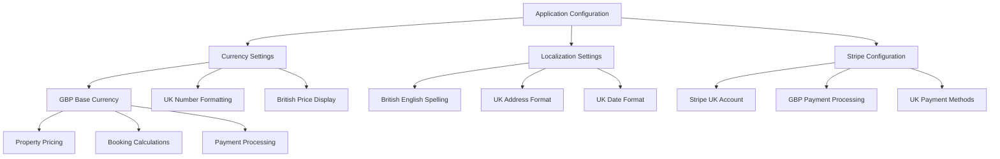
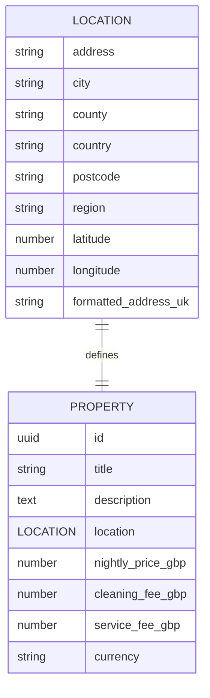
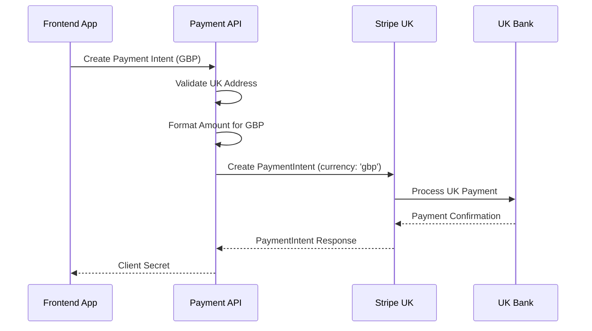
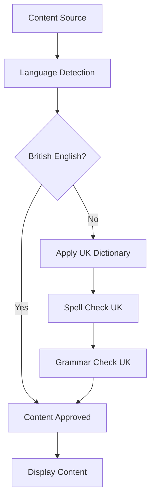
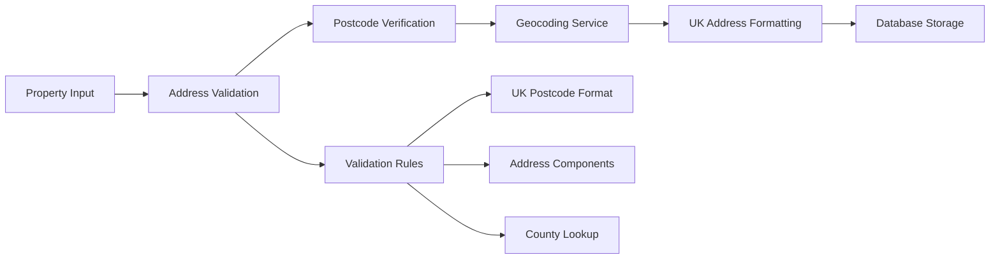
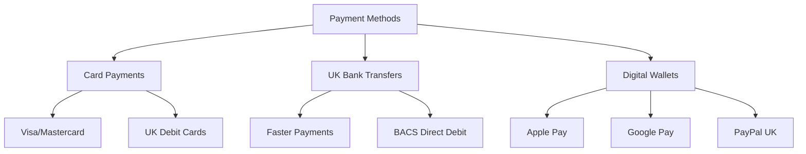
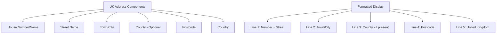
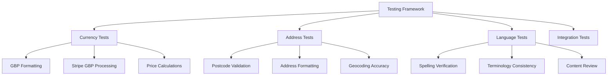
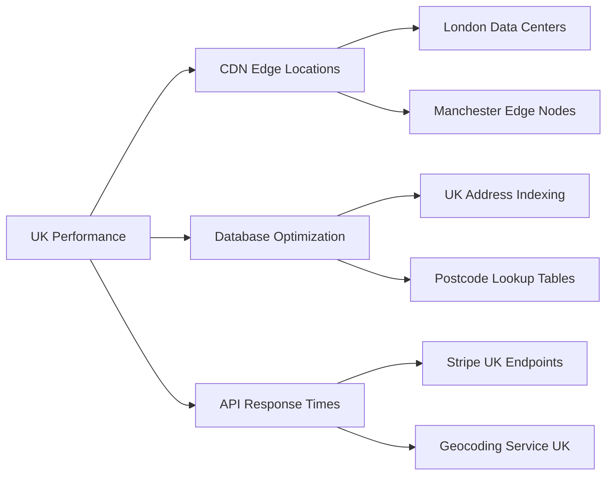

# United Kingdom Localization Configuration Design

## Overview

This design document outlines the comprehensive changes required to convert the Weci-Homes application from a US-based configuration to a United Kingdom-based configuration. The conversion encompasses currency localization (USD to GBP), language localization (American English to British English), address formatting standards, and the integration of a specific UK property: "Rochdale Hideaway Huge 5 Bedroom House" at 123 Manchester Road, Rochdale, OL114JG.

## Technology Stack Impact

### Currency System Migration
- **Current**: USD currency processing through Stripe
- **Target**: GBP currency processing with UK-specific formatting
- **Impact Areas**: Payment processing, price display, currency formatting utilities

### Localization Framework
- **Language**: British English terminology and spelling conventions
- **Address Format**: UK postcode system and address structure
- **Date Format**: UK standard (DD/MM/YYYY)
- **Number Format**: UK decimal and thousand separators

## Architecture Changes

### Currency Configuration Architecture



### Data Model Extensions

#### Location Model Enhancement



### UK Address Validation Schema

| Field | Type | Constraints | Description |
|-------|------|-------------|-------------|
| `address` | TEXT | NOT NULL | Street address (house number + street name) |
| `city` | TEXT | NOT NULL | City or town name |
| `county` | TEXT | NULLABLE | County (e.g., Greater Manchester) |
| `country` | TEXT | DEFAULT 'United Kingdom' | Country designation |
| `postcode` | TEXT | NOT NULL, PATTERN '[A-Z]{1,2}[0-9R][0-9A-Z]? [0-9][ABD-HJLNP-UW-Z]{2}' | UK postcode format validation |
| `region` | TEXT | NULLABLE | Administrative region (England, Scotland, Wales, Northern Ireland) |

## Configuration Management

### Environment Configuration Updates

```typescript
// Configuration constants for UK localization
export const UK_CONFIG = {
  currency: {
    code: 'GBP',
    symbol: '£',
    locale: 'en-GB',
    decimalPlaces: 2
  },
  address: {
    format: 'UK',
    postcodePattern: /^[A-Z]{1,2}[0-9R][0-9A-Z]? [0-9][ABD-HJLNP-UW-Z]{2}$/,
    requiredFields: ['address', 'city', 'postcode']
  },
  dateTime: {
    locale: 'en-GB',
    dateFormat: 'DD/MM/YYYY',
    timeFormat: '24h'
  },
  language: {
    locale: 'en-GB',
    dictionary: 'british-english'
  }
}
```

### Stripe Configuration Adaptation



## British English Language Localization

### Terminology Mapping

| American English | British English | Context |
|------------------|-----------------|---------|
| Apartment | Flat | Property Type |
| Elevator | Lift | Amenity |
| Parking lot | Car park | Amenity |
| Trash | Rubbish | Amenity |
| Vacation rental | Holiday let | General |
| Check-in/Check-out | Arrival/Departure | Booking |
| Zip code | Postcode | Address |
| State | County | Location |

### Content Localization Strategy



## Property Integration: Rochdale Hideaway

### Property Specification

```typescript
interface RochdaleProperty {
  id: 'rochdale-hideaway-001',
  title: 'Rochdale Hideaway Huge 5 Bedroom House',
  description: string, // British English description
  location: {
    address: '123 Manchester Road',
    city: 'Rochdale',
    county: 'Greater Manchester',
    country: 'United Kingdom',
    postcode: 'OL11 4JG',
    region: 'England',
    latitude: 53.6097,
    longitude: -2.1561
  },
  capacity: {
    guests: 10,
    bedrooms: 5,
    bathrooms: 3,
    beds: 6
  },
  nightly_price: number, // In GBP
  currency: 'GBP'
}
```

### Property Data Migration



## Payment System Localization

### Currency Handling Architecture

```typescript
// Updated currency formatting utilities
interface CurrencyConfig {
  code: 'GBP'
  locale: 'en-GB'
  formatOptions: {
    style: 'currency',
    currency: 'GBP',
    currencyDisplay: 'symbol',
    minimumFractionDigits: 2,
    maximumFractionDigits: 2
  }
}

// Stripe amount formatting for GBP
const formatGBPForStripe = (amount: number): number => {
  // GBP uses pence (1/100 of pound), similar to USD cents
  return Math.round(amount * 100)
}
```

### UK Payment Methods Integration



## Data Migration Strategy

### Phase 1: Configuration Updates

1. **Environment Variables**
   - Update currency settings to GBP
   - Configure UK Stripe account keys
   - Set British English locale

2. **Utility Functions**
   - Modify currency formatting functions
   - Update address validation patterns
   - Implement UK date formatting

### Phase 2: Content Localization

1. **Text Content**
   - Convert American spellings to British spellings
   - Update terminology throughout the application
   - Modify help text and user messages

2. **Form Validation**
   - Implement UK postcode validation
   - Update address form structure
   - Add county field support

### Phase 3: Data Structure Changes

```sql
-- Database migration for UK localization
ALTER TABLE properties 
ADD COLUMN currency VARCHAR(3) DEFAULT 'GBP',
ADD COLUMN location_country VARCHAR(50) DEFAULT 'United Kingdom';

-- Update existing properties to GBP
UPDATE properties 
SET currency = 'GBP' 
WHERE currency IS NULL OR currency = 'USD';

-- Add UK postcode validation constraint
ALTER TABLE properties 
ADD CONSTRAINT uk_postcode_format 
CHECK (location->>'zip_code' ~ '^[A-Z]{1,2}[0-9R][0-9A-Z]? [0-9][ABD-HJLNP-UW-Z]{2}$');
```

## Address Formatting System

### UK Address Structure



### Address Validation Rules

| Component | Validation Rule | Example |
|-----------|----------------|---------|
| House Number/Name | Required, alphanumeric | "123" or "Flat 4A" |
| Street Name | Required, text | "Manchester Road" |
| Town/City | Required, text | "Rochdale" |
| County | Optional, text | "Greater Manchester" |
| Postcode | Required, UK format | "OL11 4JG" |
| Country | Default "United Kingdom" | "United Kingdom" |

## Testing Strategy

### Localization Testing Framework



### Test Cases for Rochdale Property

1. **Address Validation Tests**
   - Verify "OL11 4JG" passes UK postcode validation
   - Confirm address components are correctly parsed
   - Test geocoding accuracy for Manchester Road, Rochdale

2. **Currency Display Tests**
   - Verify prices display with £ symbol
   - Confirm British number formatting (commas, decimals)
   - Test Stripe payment processing in GBP

3. **Content Localization Tests**
   - Verify British English terminology usage
   - Confirm proper spelling throughout the application
   - Test address display format compliance

## Security Considerations

### UK GDPR Compliance

- Data processing compliance for UK users
- Cookie consent management for UK visitors
- Right to be forgotten implementation
- Data transfer agreements post-Brexit

### Payment Security

- PCI DSS compliance for UK card processing
- Strong Customer Authentication (SCA) requirements
- UK banking regulation compliance
- Fraud prevention for UK transactions

## Performance Optimization

### UK-Specific Performance Enhancements



### Caching Strategy for UK Data

- Postcode to latitude/longitude mappings
- UK county and region lookups  
- British English spell-check dictionaries
- Currency conversion rate caching (if needed)